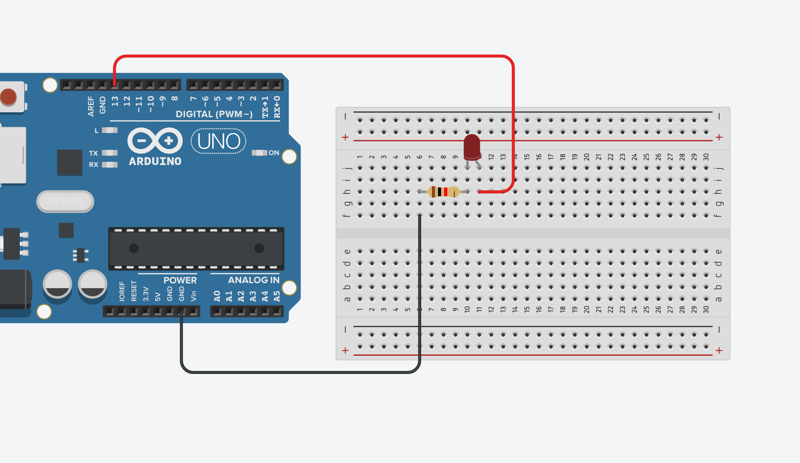
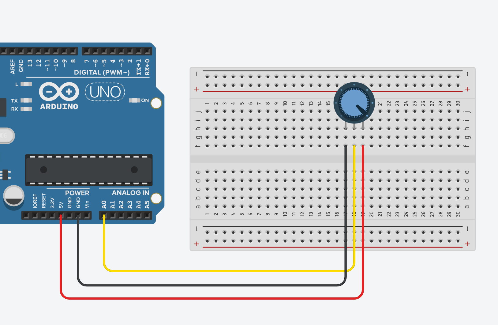
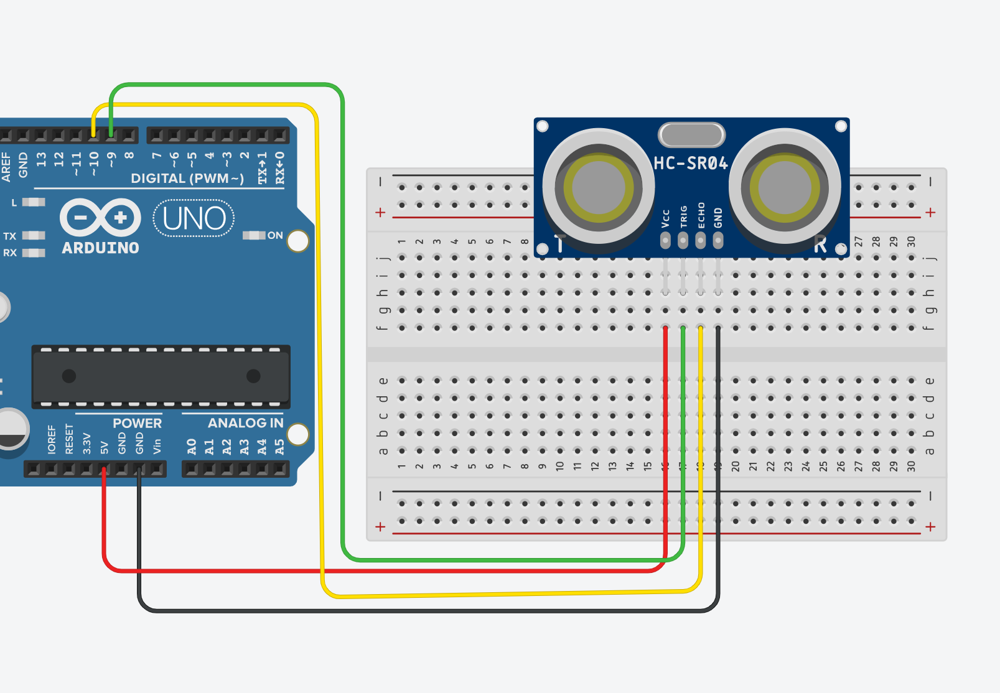
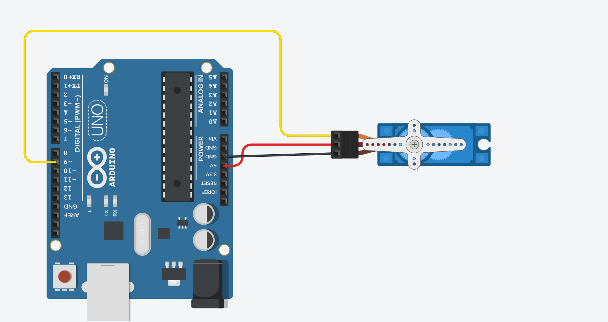

# Примеры программ на Arduino

## Содержание


1. [Основные части кода](./MainPrograms.md#основные-части-кода)
   * [Мигание светодиодом](./MainPrograms.md#мигание-светодиодом)
   * [Чтение аналоговых сигналов](./MainPrograms.md#чтение-аналоговых-сигналов)
   * [Датчик расстояния HC-SR04](./MainPrograms.md#датчик-расстояния-hc-sr04)
   * [Движение сервопривода](./MainPrograms.md#движение-сервопривода)
2. [Расширение программ](./MainPrograms.md#расширение-программ)
   * [Светофор](./MainPrograms.md#светофор)
   * [Ночной свет](./MainPrograms.md#ночной-свет)
   * [Яркость светодиода по потенцометру](./MainPrograms.md#яркость-светодиода-по-потенцометру)
   * [Бесшумный парктроник](./MainPrograms.md#бесшумный-парктроник)
   * [Электронная дверь](./MainPrograms.md#электронная-дверь)

<br>

## Основные части кода

### Мигание светодиодом




```cpp

// Будем включать светодиод, подключенный к 13 пину
#define ledPin 13

void setup() {
  // Устанавливаем пин в режим выхода
  pinMode(ledPin, OUTPUT);
}

void loop() {

    // включаем светодиод
    digitalWrite(ledPin, HIGH);
    // Ждем 1 секунду (1000 миллисекунд)
    delay(1000);
    
    // Выключаем светодиод
    digitalWrite(ledPin, LOW);
    // Ждем еще 1 секунду
    delay(1000);
}


```


### Чтение аналоговых сигналов



```cpp

// Устанавливаем пин, к которому подключен аналоговый датчик
#define analogPin A0

void setup() {

    // Включаем Serial порт на скорость 9600
    Serial.begin(9600);
}

void loop() {

    // Считываем значение с аналогового пина
    int sensorValue = analogRead(analogPin);

    // Выводим значение в Serial Monitor
    Serial.print("Analog value: ");
    Serial.println(sensorValue);

    // Задержка
    delay(500);
}


```

### Датчик расстояния HC-SR04*



```cpp

const int trigPin = 9;  // Пин для TRIG
const int echoPin = 10; // Пин для ECHO

void setup() {
  pinMode(trigPin, OUTPUT);
  pinMode(echoPin, INPUT);
  
  Serial.begin(9600);
}

void loop() {
  // Генерация ультразвукового импульса
  digitalWrite(trigPin, 0);
  delayMicroseconds(2);
  digitalWrite(trigPin, 1);
  delayMicroseconds(10);
  digitalWrite(trigPin, 0);

  // Измерение длительности импульса на ECHO
  long duration = pulseIn(echoPin, 1);

  float distance = (duration * 0.0343) / 2;

  // Вывод расстояния в последовательный порт
  Serial.println(distance);

  delay(500); // Задержка перед следующим измерением
}


```

### Движение сервопривода



```cpp

#include <Servo.h> // Подключение библиотеки

Servo myServo;     // Создание объекта для управления сервоприводом

const int servoPin = 9; // Пин подключения сервопривода

void setup() {
  myServo.attach(servoPin); // Привязка сервопривода к пину
}

void loop() {
  // Пример: поворот сервопривода на 0°, 90° и 180° с задержкой
  myServo.write(0);   // Установить угол 0°
  delay(1000);        // Задержка 1 секунда

  myServo.write(90);  // Установить угол 90°
  delay(1000);        // Задержка 1 секунда

  myServo.write(180); // Установить угол 180°
  delay(1000);        // Задержка 1 секунда
}

```

<br>

## Расширение программ

### Светофор

### Ночной свет

### Яркость светодиода по потенцометру

### Бесшумный парктроник

### Электронная дверь


<br><br>
<br><br>

###### 05.11.2024