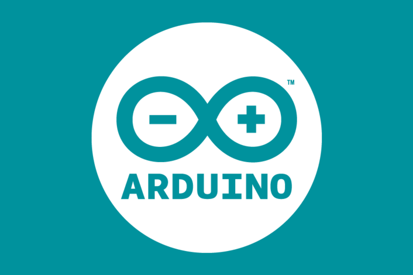

# **Arduino**


## Содержание

1. [Введение](./README.md#введение)
2. [Установка программ](./README.md#установка-программ)
3. [Виды плат и их различия](./README.md#виды-плат)
4. [Интересные проекты](./README.md#интересные-проекты)
5. [Полезные ссылки](./README.md#полезные-ссылки)
6. [Примеры простых программ](./MainPrograms.md)
7. [Примеры специфичных программ](./OtherPrograms.md)

## Введение

**Arduino** - это платформа для разработки и программирования микроконтроллеров. Arduino  позволяет создавать различные устройства и системы, используя микроконтроллеры Arduino (они же STM32 или Atmega256), которые  можно программировать с помощью языка программирования C++ или Arduino IDE.

Множество DIV проектов написано на arduino подобных платах. На YouTube есть множетсво каналов, которые  показывают как создавать различные самодельные устройства и системы, облегчающие жизнь, с помощью Arduino. 

Разве не интересно создавать что-то новое и полезное? Тем более, что это не сложно. При работе с arduino не требуются специальные знания электроники, программирования или чего-то еще более специфичного.

В базовой конструкции кода arduino есть 2 функции:  `setup()` и `loop()`. 
Функция setup() выполняется один раз при включении устройства, а  функция loop() выполняется бесконечно, пока устройство включено.

```cpp

// выполнится один раз
void setup() {

}

// выполняется  бесконечно
void loop() {

}

```


## Виды плат

У Arduino существует множество видов плат, которые можно  использовать для различных целей. Некоторые из них:

| Плата            | Процессор        | Тактовая частота | Память Flash | Память RAM | Кол-во GPIO | Особенности                                     | Примеры проектов                       |
|------------------|------------------|------------------|--------------|------------|-------------|------------------------------------------------|----------------------------------------|
| **Arduino Uno**  | ATmega328P       | 16 МГц          | 32 КБ        | 2 КБ       | 14          | Простота, поддержка большинства базовых проектов | Умный дом (контроль света, датчики)     |
| **Arduino Mega** | ATmega2560       | 16 МГц          | 256 КБ       | 8 КБ       | 54          | Подходит для проектов с большим числом подключений | 3D-принтер, роботы                    |
| **Arduino Nano** | ATmega328P       | 16 МГц          | 32 КБ        | 2 КБ       | 14          | Компактность, подходит для интеграции в небольшие устройства | Носимая электроника (LED-аксессуары)  |
| **ESP8266**      | Tensilica L106   | 80/160 МГц      | До 4 МБ      | 50 КБ      | 17          | Wi-Fi модуль, низкая цена, популярна для IoT     | Умное освещение (удаленный контроль)   |
| **ESP32**        | Xtensa Dual-Core | 160/240 МГц     | До 16 МБ     | 520 КБ     | 36          | Поддержка Wi-Fi и Bluetooth, высокая производительность | Автоматизированная метеостанция       |

**Дополнительные пункты к платам**
1. **Arduino Uno**

   - Простота использования: Поддерживается огромным сообществом, доступно множество библиотек.
   - Ограниченные возможности связи: Нет встроенных модулей связи, поэтому нужно подключать отдельно (например, модуль Bluetooth или Wi-Fi).

2. **Arduino Mega**

    - Расширенная периферия: Идеально подходит для проектов, где требуется множество подключений и модулей (например, дисплей, моторы).
    - Недостаток компактности: По размерам больше, чем Uno, что может быть неудобно для компактных проектов.
  
3. **Arduino Nano**

   - Миниатюрность: За счет небольшого размера Nano можно встраивать в устройства с ограниченным пространством.
Меньшее количество пинов: По сравнению с Mega, Nano не имеет такого большого числа GPIO.

4. **ESP8266**

   - Экономичность: Одна из самых дешевых плат с Wi-Fi, что делает её популярной для проектов IoT.
   - Ограниченная поддержка Bluetooth: Нет поддержки Bluetooth, что ограничивает ее использование в многозадачных проектах, требующих нескольких протоколов связи.

5. **ESP32**

   - Высокая производительность и многозадачность: С поддержкой двух ядер и большим объемом памяти ESP32 способен выполнять сложные задачи.
   - Поддержка Bluetooth и Wi-Fi: Модуль работает с обоими протоколами связи, что открывает больше возможностей для удаленного управления и передачи данных.


## Установка и работа с программой

Для прошивки и работы  с Arduino необходима специальная программа. 

Arduino IDE можно установить через официальный сайт arduino: 

https://www.arduino.cc/en/Guide/Environment

Просто следуйте инструкции на сайте.

## Основные понятия и термины

* **Порт** — это логическая точка ввода-вывода, которая может быть запрограммирована для передачи или получения данных. В Arduino порты обозначены как digital и analog и используются для подключения к компонентам, таким как датчики или светодиоды.

* **Плата** — физическая основа устройства Arduino, на которой находится микроконтроллер, а также порты и пины для подключения различных компонентов. Примеры плат: Arduino Uno, Arduino Mega, ESP8266 и ESP32. Платы различаются по характеристикам (число пинов, поддержка Wi-Fi и т.д.) и подходят для разных проектов.

* **Пин** (Pin) — это физический контакт на плате, к которому можно подключать компоненты, такие как датчики, светодиоды или кнопки. Пины бывают:

    - Цифровые пины (Digital Pins) — передают либо высокий (HIGH), либо низкий (LOW) сигнал, то есть включены или выключены.
    - Аналоговые пины (Analog Pins) — позволяют считывать аналоговые сигналы и передавать их в цифровое представление (ADC — аналогово-цифровое преобразование).

* **Земля** (GND) — общая точка отсчета напряжения для цепи. Все компоненты в схеме должны подключаться к общей земле для замыкания цепи и корректной работы. В Arduino обозначается как GND и обычно помечается черным проводом.

* **5 вольт** (5V) — выходное напряжение, которое Arduino может подавать на подключенные устройства и компоненты. Используется для питания различных компонентов (например, датчиков, LED) напрямую от платы. В некоторых платах (например, ESP8266) может использоваться и 3.3 вольта.

* **Датчик** — компонент, который измеряет различные параметры окружающей среды (температура, влажность, свет и т.д.) и передает данные на Arduino. Датчики бывают аналоговыми и цифровыми, и в зависимости от типа, подключаются к аналоговым или цифровым пинам. Примеры: датчик температуры DHT11, датчик расстояния HC-SR04.

* **Светодиод** (LED) — полупроводниковый прибор, который излучает свет при прохождении через него тока. Светодиоды часто используются как индикаторы состояния (включен/выключен) в схемах на Arduino и могут управляться с цифровых пинов.

* **Сигнал** (Signal) — данные, передаваемые от компонента к Arduino или от Arduino к компоненту. Сигнал может быть цифровым (например, высокий/низкий) или аналоговым (переменные уровни напряжения), и часто обозначается как сигнальный пин на компонентах, подключенных к Arduino.

* **Прозвонка** — тестирование целостности цепи для проверки соединения между пинами и компонентами. Прозвонка позволяет найти обрывы или короткие замыкания, а также проверить правильность подключения, особенно при использовании нескольких компонентов.

<br>

## Интересные проекты

Вот подборка из 20 интересных и сложных проектов на Arduino, которые подойдут для различных уровней подготовки — от начинающих до продвинутых пользователей. Эти проекты позволяют изучить разнообразные аспекты работы с Arduino, такие как работа с датчиками, беспроводной связью, дисплеями, управлением моторами и другими компонентами.

### Для начинающих

1. **Умный термометр с ЖК-дисплеем**

    Использует датчик температуры (например, DHT11 или DS18B20) для измерения температуры и влажности. Вывод значений осуществляется на ЖК-дисплей. Отличный проект для изучения работы с датчиками и дисплеями.

2. **Цифровой музыкальный инструмент**

    Создайте клавишный инструмент на основе пьезоэлемента и кнопок. Arduino воспроизводит разные ноты при нажатии кнопок. Можно добавить регулировку громкости и высоты звука.

3. **Мини-метеостанция**

    Используйте несколько датчиков (температура, влажность, давление) и соберите данные на ЖК-дисплей. Проект помогает освоить работу с несколькими датчиками и базовыми принципами мониторинга.

4. **Сигнализация с датчиком движения**

    Использует датчик движения PIR, который срабатывает при обнаружении движения, и звуковой сигнал для оповещения. Полезно для простых проектов домашней безопасности.

5. **Часы на светодиодной матрице**

    Постройте цифровые часы с использованием RTC-модуля (DS3231) и светодиодной матрицы. Осваивает основы работы с реальным временем и отображением данных на LED.

6. **Контроль уровня воды**

    Постройте систему, которая контролирует уровень воды в емкости и срабатывает, когда вода достигает определенного уровня. Помогает изучить принципы работы с датчиками уровня жидкости.

7. **Автоматическая кормушка для животных**

    Создайте автоматическую кормушку с использованием сервопривода, который открывает кормушку по расписанию. Полезно для освоения работы с двигателями и таймингом.
8. **Сенсорный музыкальный коврик**

    Постройте коврик с сенсорными кнопками, который воспроизводит ноты при нажатии. Проект поможет разобраться с тактильными сенсорами и звуковым воспроизведением.

9. **Электронная рулетка**

    Создайте рулетку, которая случайным образом выбирает числа на экране при нажатии кнопки. Проект учит генерации случайных чисел и работы с ЖК-дисплеем.

10. **Bluetooth-контроллер для смартфона**

    Используйте Bluetooth-модуль HC-05 для создания контроллера, который подключается к смартфону и управляет простым приложением или другим устройством. Хорошо для изучения основ связи Bluetooth.

### Для продвинутых

1. **Робот-полотер**

    Создайте робота с моторизированными колесами и щетками, который очищает пол, используя датчики для ориентации и избегания препятствий. Отлично подходит для освоения сложного управления моторами и датчиками расстояния.

2. **Умное зеркало**

    Постройте интерактивное зеркало, которое показывает дату, время, погоду и другую информацию на ЖК-дисплее или через модуль Wi-Fi. Для отображения можно использовать OLED-экран и ESP8266 для получения данных из интернета.

3. **Смарт-контроллер для теплицы**

    Создайте контроллер для управления температурой, влажностью и освещением в теплице с использованием реле и датчиков. ESP32 позволяет подключить систему к облаку для удаленного мониторинга.

4. **Автономный мини-дрон**

    Используйте гироскоп, акселерометр и контроллер для создания мини-дрона. Проект требует навыков пайки, а также понимания стабилизации и управления моторами.

5. **Робот для распознавания лиц**

    Создайте робота с камерой и модулем ESP32, который может распознавать лица и реагировать на определенные команды. Сложный проект, в котором используется машинное зрение.

6. **Радиоуправляемая модель автомобиля**

    Постройте автомобиль на базе Arduino с управлением через Bluetooth или радиосигнал. Можно добавить камеру для видеопередачи и ультразвуковые датчики для избегания препятствий.

7. **Умный дверной замок**

    Создайте замок с доступом по паролю или через приложение на смартфоне. Используйте серводвигатель для управления замком и RFID-считыватель для безопасности.

8. **Wi-Fi метеостанция с веб-интерфейсом**

    Используйте ESP8266 или ESP32 для сбора данных о температуре, влажности и передаче их на веб-страницу, где их можно контролировать в реальном времени.

9. **Лазерный лабиринт**

    Постройте лабиринт из лазерных указателей и датчиков, который можно использовать как игру для детей. Проект помогает освоить принципы работы с лазерами и оптическими сенсорами.

10. **Робот-манипулятор с управлением через приложение**

    Создайте роботизированный манипулятор с несколькими степенями свободы, управляемый через смартфон или планшет. Подходит для изучения сложной механики и управления моторами.


## Полезные ссылки

1. [YouTube канал AlexGyver](https://www.youtube.com/channel/UCgtAOyEQdAyjvm9ATCi_Aig)
2. [Arduino сайт](https://www.arduino.cc/)
3. [GitHub arduino](https://github.com/Arduino)


<br><br>
<br><br>

###### 05.11.2024