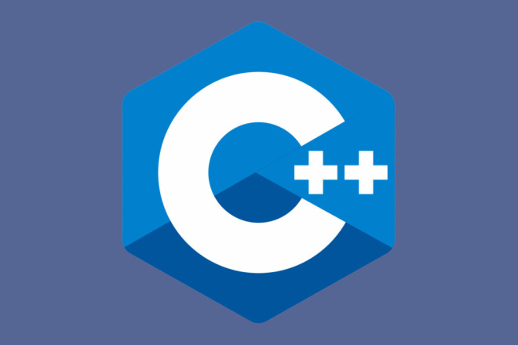

# **C++**

## Содержание

1. [Введение](README.md#введение)
2. [База С++](./README.md#база-c)
3. [Реализуемые методы](./README.md#реализуемые-методы-и-части-кода)
4. [Ввод-вывод в C++](./README.md#работа-с-вводом-выводом-в-c)

<br>

## Введение

C++ — компилируемый, статически типизированный язык программирования общего назначения.

## База C++

1. [Типы данных и математические операции](./TypesOfData.md)
2. [Условия и ветвления](./Conditions.md)
3. [Циклы и их виды](./Сycle.md)

## Реализуемые методы и части кода

1. [Шейкерная сортировка](./Sheuker.md)
2. [НОД на C++](./NOD.md)

## Работа с вводом-выводом в C++

Многие уже знакомы хотя бы с одним языком программирования. Скорее всего это python.
В C++ для выполнения почти любого действия требуется подключать специальные библиотеки.
Чаще всего они являются встроенным, как например `iostream`. Как раз эта библиотека позволяет
работать с вводом-выводом какой-либо информации в терминале.

Вот пример:

```C++

#include <iostream>

// подлючаем пространство имен std
using namespace std;

int main(){

    cout << "Hello" << endl;
    return 0;
}

```

> Важным моментом здесь являются то, что мы `подключаем пространство имен std`. 
> По началу это может вызывать непонимание, но без этой строчки код будет выглядеть не таким простым.
> Если говорить простыми словами, то запись `using namespace std;`  говорит компилятору, что все функции и переменные из пространства имен std
> должны быть подставлены автоматически при компиляции.

Во так должен выглядеть код без подключения пространства имен:

```C++

#include <iostream>


int main(){

    std::cout << "Hello" << std::endl;

    return 0;
}

```

Постоянно прописывать подобные конструкции не очень то и эффективно... 
В этом плане python куда более приветливый, но есть крутая фраза: "Все, что ни написано в этом мире было написано на C++ в каком-то смысле.". Знать C++ значит понимать всю базу программирования и базу большинства языков программирования, ведь большинство конструкций будут схожи, а переменные объявляются абсолютно одинаково.

Перед тем, как продолжить упростим код:

```cpp

#include <iostream>

using namespace std;

int main(){

    cout << "Hello" << endl;

    return 0;
}

```

Теперь при работе больше не придется прописывать особые имена стандартизации.

Но как вводить свои данные с клавиатуры, а не выводить значение переменных?

```cpp

#include <iostream>

using namespace std;

int main(){
    int a;

    cin >> a;
    cout << "Твое число: " << a << endl;

    return 0;
}

```

### Работа с математикой

При работе с математическими выражениями, подобно тому, как мы подключали библиотеку для работы с консолью, мы подключаем библиотеку для работы с математикой

### Работа с файлами

При работе с файлами используется библиотека `fstream`. Она так же, как и `iostream` требует использовать пространство имен вида `std`. Поэтому подключив один раз:

```cpp

using namespace std;

```

Можно избавиться от многих.


###### 08.11.2024 - последнее изменения данной директории