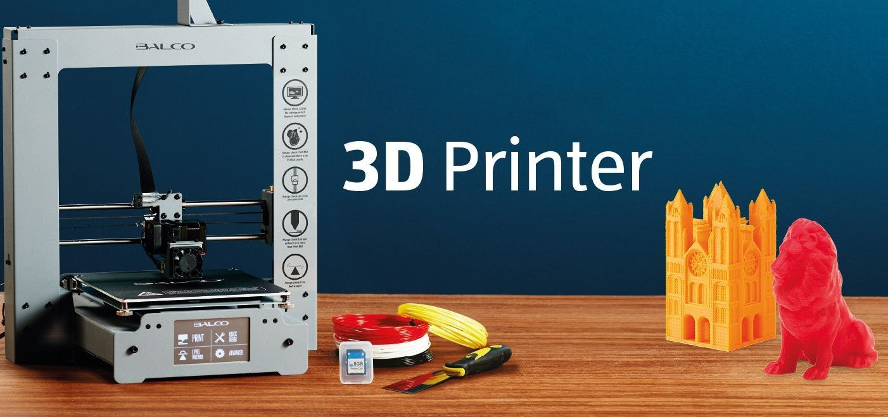

# 3Д печать с использованием программ 3Д печати

## Содержание

1. [Введение](./3DPrint.md#введение)
2. [Теория 3Д печати](./3DPrint.md#теория-3д-печати)
3. [Установка программ 3Д печати](./3DPrint.md#установка-программы-3д-печати)
4. [Настройка 3Д печати](./3DPrint.md#настройка-3д-печати)

## Введение

В современном мире нас окржает огромное количество пластика. Пластиковые бутылки, игрушки, заптчасти и даже сложная техника. Все из-за его относительно низкой цены, простоты в производстве, физических характеристик и долгого срока службы.

В некоторых инженерных проектах было бы неплохо изготавливать собственные детали или целые конструкции из пластика. Как раз подобную возможность предоставляет 3Д печать. Технология, позволяющая восзодавать даже самые необычные формы, которые только можно предстваить в 3-х мерном пространстве, оказывается незаменимым помощником в IoT или каких-то самостоятельных DIV проектах.

## Установка программы 3Д печати

## Настройка 3Д печати

  
  

###### 26.10.2024