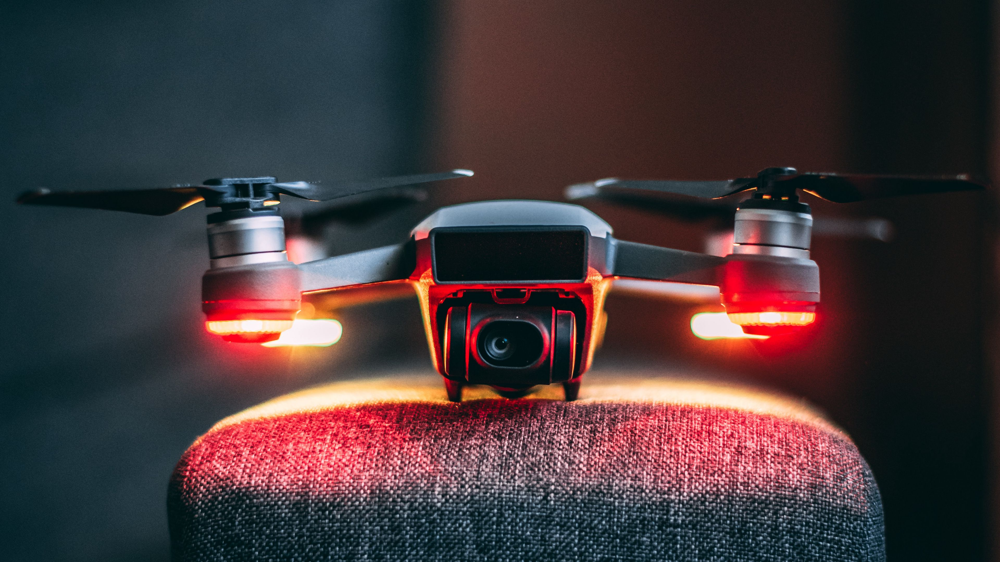

# Дроны и БПЛА

## Содержание

1. [Введение](./Drone.md#введение)
2. [Вся теория БПЛА](./Drone.md#вся-теория-бпла)
3. [Сборка БПЛА](./Drone.md#сборка-бпла)
4. [Симуляция](./Drone.md#симуляция)
   - [Полет в симуляторе](./Drone.md#полет-в-симуляторе)
   - [Gazebo](./Drone.md#gazebo)
5. [(COEX CLEVER) Интересные проекты](./Drone.md#coex-clever)

## Введение

БПЛА - безпилотные летательные аппараты. Область применения БПЛА огромна. Начиная от поиска,  до съемки видео и фотографий. БПЛА могут быть использованы в различных сферах деятельности: военная промышленность, сельское хозяйство, гражданская авиация, спорт, исследовательские проекты и многое другое.

## Вся теория БПЛА

## Сборка БПЛА

## Симуляция

### Полет в симуляторе

### Gazebo

## COEX CLEVER

  
  

###### 26.10.2024