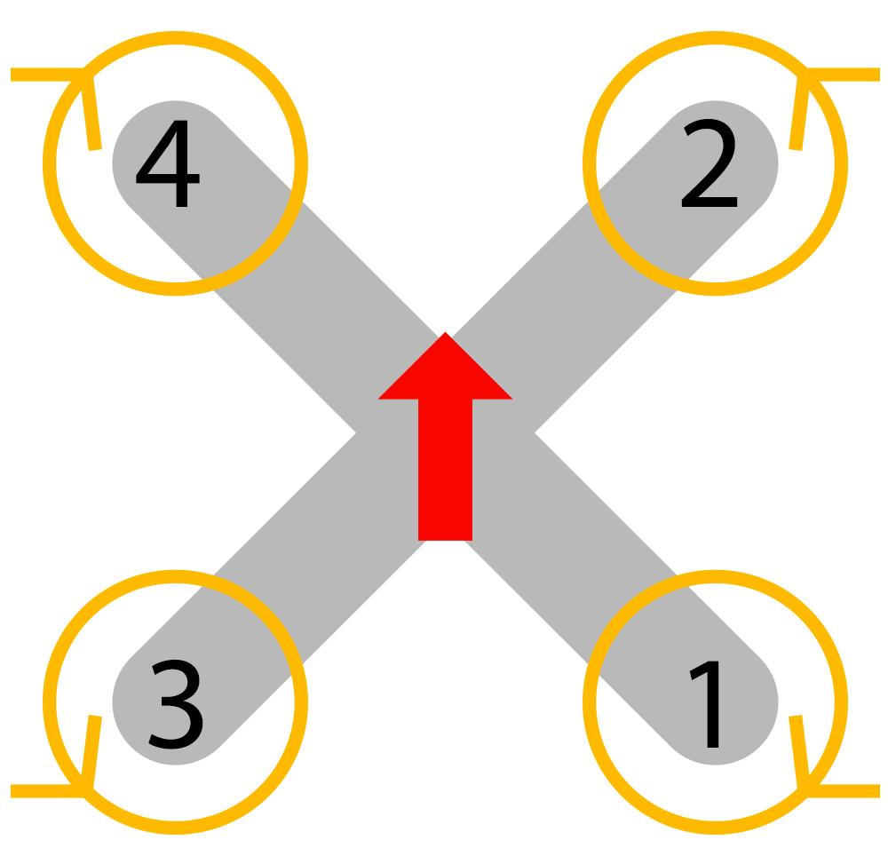

# Дроны и БПЛА

## Содержание

1. [Введение](./Drone.md#введение)
2. [Вся теория БПЛА](./Drone.md#вся-теория-бпла)
3. [Сборка БПЛА](./Drone.md#сборка-бпла)
4. [Прошивка, настройка, подключение и не только](./Drone.md#прошивка-настройка-подключение-и-не-только)
5. [Симуляция](./Drone.md#симуляция)
   - [Полет в симуляторе](./Drone.md#полет-в-симуляторе)
   - [Gazebo](./Drone.md#gazebo)
   - [Полет на micro woop](./Drone.md#полет-на-micro-woop)
   - [Полет в реальной жизни](./Drone.md#полет-в-жизни)
6. [(COEX CLEVER) Интересные проекты](./Drone.md#coex-clever)

## Введение

**БПЛА** - беcпилотные летательные аппараты. Область применения БПЛА огромна. Начиная от поиска,  до съемки видео и фотографий. БПЛА могут быть использованы в различных сферах деятельности: военная промышленность, сельское хозяйство, гражданская авиация, спорт, исследовательские проекты и многое другое.

Использование беспилотников это весьма спорный момент, учитывая большой спектр их применения создается впечатление, что это какой-то универсальный способ, которым мы можем решить все проблемы и задачи. Но в реальности  все не так просто. БПЛА могут быть использованы для различных целей, но они также требуют различных условий эксплуатации, что делает их не универсальными, а специализированными под конкретные задачи.

> Помню, как российская кампания "Почта России" создала своего дрона для доставки посылок.
> Результат был, правда какой... Почему-то инженеры, разрабатывающие его, не смогли учесть самого банального - сопротивление ветра и что на разных высотах сила ветра разная... 
> Казалось бы какая нелепая ошибка, но из-за этой неточности дорогой дрон оказался разбит спустя 5 минут, после запуска.
> 
> Во многих фильмах и книгах показано, что дроны используются повсеместно: для доставки, для обороны, поиска и т.п. В наших реалях все это чересчур дорого и не практично. Все ожидают, что дроны могут заменить человека в нетривиальных задачах, но это не так. Дроны могут заменить человека только в тех случаях, когда сам человек и управляет беспилотником. На сегодняшний день даже есть профессия - "Оператор наземными средствами БПЛА", а это уж о чем-то да говорит...

## Вся теория БПЛА

Как ни странно, но даже среди беспилотников есть много видов. 
Опять же, БПЛА универсальны, но каждый в своем деле, поэтому под разные задачи нужно использовать разные категории беспилотников.

Пример, иллюстрированный в таблице:

| **Категория БПЛА**          | **Назначение**                                                              | **Характеристики**                                              | **Примеры**                                                |
|-----------------------------|----------------------------------------------------------------------------|-----------------------------------------------------------------|-------------------------------------------------------------|
| **Разведывательные БПЛА**   | Сбор информации, разведка и наблюдение                                     | Небольшие размеры, оснащены камерами и сенсорами               | RQ-4 Global Hawk (США), Elbit Hermes 900 (Израиль)         |
| **Ударные БПЛА**            | Нанесение ударов по целям                                                  | Вооружение (ракеты, бомбы), высокая дальность и продолжительность полета | MQ-9 Reaper (США), Bayraktar TB2 (Турция)                   |
| **Многоцелевые БПЛА**       | Универсальные задачи (разведка, наблюдение, атака)                         | Комбинация функций разведки и ударных возможностей             | Elbit Hermes 450 (Израиль), Predator (США)                 |
| **Тактические БПЛА**        | Поддержка войск на поле боя                                                | Компактные, малый радиус действия, простота в использовании    | Raven RQ-11B (США), Orbiter 3 (Израиль)                    |
| **Стратегические БПЛА**     | Длительные операции на большой глубине противника                          | Большая дальность, длительное время в воздухе, стратегическое наблюдение | RQ-170 Sentinel (США), Shahed 129 (Иран)                   |
| **Барражирующие боеприпасы**| Атака цели путем самоподрыва                                               | Барражируют над зоной, атакуют при обнаружении цели            | Switchblade 300 (США), Shahed-136 (Иран)                   |
| **Гражданские БПЛА**        | Коммерческое применение (аэрофотосъемка, доставка)                         | Компактные, ограниченная дальность полета                      | DJI Phantom 4 (Китай), Wingcopter 178 (Германия)           |

Ну а если рассматривать виды БПЛА, то в большинстве случаев их разделяют по количеству моторов:

| **Тип БПЛА**           | **Описание**                                                    | **Характеристики**                                               | **Примеры**                                               |
|------------------------|-----------------------------------------------------------------|------------------------------------------------------------------|------------------------------------------------------------|
| **Квадрокоптер**       | Дрон с четырьмя роторами                                       | Легкий, маневренный, стабильный, подходит для съемки и разведки  | DJI Phantom, Parrot Anafi                                  |
| **Гексакоптер**        | Дрон с шестью роторами                                         | Более грузоподъемный, стабилен при ветре, подходит для тяжелого оборудования | DJI Matrice 600, Yuneec Tornado H920                      |
| **Октокоптер**         | Дрон с восемью роторами                                        | Высокая грузоподъемность, резервная надежность, устойчив к ветру | Freefly Alta 8, DJI Agras MG-1                             |
| **Самолетного типа**   | Фиксированное крыло, как у самолета                             | Длинная дальность и время полета, сложен в запуске и посадке     | RQ-4 Global Hawk, Parrot Disco                             |
| **Гибридный БПЛА**     | Совмещает роторы и фиксированные крылья                         | Вертикальный взлет и посадка, высокая дальность                 | WingtraOne, Arcturus Jump 20                               |
| **Тилтротаторный БПЛА**| Дрон с поворотными роторами, которые меняют угол наклона        | Универсальность, может быстро переходить из зависания в полет    | Bell V-280 Valor (военная разработка), Kestrel от Vahana  |
| **Крыло летучей мыши** | Необычная конструкция крыла, часто малозаметный                | Аэродинамичная форма, малозаметность, оптимально для разведки    | RQ-170 Sentinel, Skywalker X8                              |
| **Вертолетного типа**  | Один или два основных ротора                                   | Прост в управлении, способен на зависание, подходит для наблюдения | Sikorsky Cypher, Lockheed Martin K-MAX                     |
| **Барражирующий боеприпас** | Дрон для барражирования над зоной и атаки цели           | Барражирует до обнаружения цели, использует самоподрыв          | Switchblade 300, Shahed-136                                |

Как уже можно понять видов и способов использовать БПЛА существует много. Но все они имеют как свои плюсы так и минусы, и каждый вид лучше использовать в определенных задачах. И, как всегда, все зависит от конкретной ситуации и условий.

## Сборка БПЛА

В этом разделе будет рассмотрена сборка самого популярного из БПЛА - квадрокоптера, но не стоит думать, что сборка остальных типов беспилотников чем-то отличается. Суть и принципы сохраняются независимо от вида устройства, главное понимать что и для чего есть в этом достаточно сложном аппарате...

Перед началом сборки желательно иметь хотя бы базовые знания и умения в области *пайки*, *электронике*. А так же прочитать [технику безопастности](https://18.mchs.gov.ru/rekomendacii-naseleniyu/bezopasnost-pri-rabote-s-elektrichestvom-i-elektropriborami) при работе с высоким  напряжением и электрическим током.

Так же перед началом работы было бы неплохо ознакомится со списком компонентов, а так же их премерным видом. В таблице ниже предствалены основные компоненты:

| **Компонент**               | **Назначение**                                                                                   | **Внешний вид**                              |
|-----------------------------|--------------------------------------------------------------------------------------------------|----------------------------------------------|
| **Полетный контроллер**     | Основной управляющий модуль, обрабатывает данные от датчиков и команд управления, стабилизирует полет |   |
| **Регуляторы оборотов (ESC)** | Управляют скоростью вращения моторов в соответствии с сигналами от полетного контроллера           |  |
| **Бесколлекторные двигатели**| Обеспечивают подъем и движение дрона, создавая тягу за счет вращения пропеллеров                   |  |
| **Пропеллеры**              | Генерируют подъемную силу и тягу, необходимую для полета                                         |               |
| **Рама**                    | Основная конструкция квадрокоптера, удерживающая все компоненты, обеспечивает жесткость и легкость |        |
| **Батарея**                 | Питает все электронные компоненты дрона, обеспечивая их энергией                                |          |
| **Камера**                  | Позволяет снимать фото и видео, используется для FPV (вид от первого лица)                       |    |
| **Передатчик**              | Передает видеосигнал с камеры на наземный приемник, позволяя оператору видеть изображение в реальном времени |        |
| **Приемник**                | Получает команды управления с пульта оператора и передает их на полетный контроллер              |    |

Теперь уже точно можно приступить к полноценной сборке:

1. **Сборка рамы**:

   Обычно рама продается уже собранной. В редких случаях нужно собрать ее из отдельных деталей. В таком случае лучше всего действовать по инструкции производителя.

   

2. **Расположение полетного контроллера**:
   Обычно полетный контроллер располагают по середине рамы. Сделано это для того, чтобы все компоненты были примерно равноудалены от "мозга" и не пришлось тянуть большие провода

   
3. **Подключение регуляторов оборотов и самих двигателей. Первое тестирование**:

   Подключить бесколлекторные двигатели и регуляторы оборотов для него не так уж сложно, главное не напутать полярности и помнить, что направление вращения моторов должны быть попарно накрест совпадающими (см картинку ниже)

   

   Если перепутать полярности можно в лучшем случае изменить вращение моторов на противоположно, а в худшем замкнуть и сжечь регуляторы. 

   **Поэтому важно перед подключением моторов к АКБ или к компьютеру необходимо прозвонить с помощью *мультиметра* все провода и контакты.**
   
   **Убедиться, что все полярности совпадают и нет замыкания.**

    

   

4. **Подключение приемника**:
   
   Расположение применика не должно мешать вращению  моторов и не должно быть в зоне воздействия воздушных поток. В идеале расположить  приемник на противоположной стороне рамы от полетного контроллера или прямо на нем, но так же допускается  расположение на раме, но не на ее верхней части. "Усы" приемника должны быть направлены разные стороны, но не сильно.  Иначе может произойти перекрестное помеховое воздействие. Обычно это подбирается опытным путем.

   

   

5. **Подключение камеры и прочей перефирии**:
   
   Камера является необязательным компонентом, но все же для FPV дронов было бы неплохо иметь камеру, которая передает положение, чтобы пилот мог своевременно отреагировать.

   Подключать камеру следует по инструкции самой камеры.

   

6. **Постановка аккумуляторной батареии**:
   
   Обычно на дроне есть специальное место или просто ремень, на который можно  закрепить батарею. Важно предусмотреть тот  факт, что батарея должна быть надежно закреплена, чтобы не упасть и не потянуть за собой весь беспилотник.

7. **Установка пропеллеров**:

   

> [!WARNING]
> Внимание, после установки пропеллеров , необходимо обязательно проверить, что все они вращаются в правильном направлении и не пересекаются. С этого момента тестовые запуски дрона должны быть проводимы только в безопасной зоне.

## Прошивка, настройка, подключение и не только

После сборки и первых проверок на мультиметре необходимо подключить квадрокоптер к пульту. 

Зачастую подключение разных пультов и разных приемников различается. Поэтому необходимо ознакомиться с инструкцией по подключению конкретного пульта и приемника.

Если рассматривать подключение конкретно к пульту [Taranis QX7](https://dr1.by/wp-content/uploads/2018/01/rus_frsky-taranis-q-x7-start-guide3.pdf?ysclid=m339yhlpth476231320) от кампании FrSky, то проще всего действовать по инструкции прикрепленной выше или по [видео](https://yandex.ru/video/preview/1431167078818236629).

> Это видео в очередной раз доказывает, что дети знают все! Именно они решили все проблемы человечества! 

Так же, в зависимости от типа полетного контроллера, необходимо использовать разные программы для прошивки и настройки.

Чаще всего можно использовать программы от пользователей (так называемое Community). Наверное самой популярной программой является бесплатный [**BetaFlight Configurator**](https://betaflight.com/download) ([если не работает прошлая ссылка](https://github.com/betaflight/betaflight-configurator/releases)).

На том же GitHub можно найти прошивку почти под каждую плату.

 

## Симуляция

Дрон собран, настроен, хочется уже и полетать, но есть некоторые ограничения и, быть может, страх.

> [!IMPORTANT]
> Дрон - это довольно мощная, опасная вещь, которой сложно начать управлять сходу. 
> Это становиться понятно после того, как понимаешь, что он может летать со скорость более 100 км/ч. 

А если такая штука врежеться в человека? Ничего хорошего точно не будет. Поэтому существуют тренировочные симуляторы, на которых можно отточить навыки управления и пилотирования, а уже потом пробовать летать на настоящем дроне.

> Хотя , если вам не терпится полетать в живую, то есть несколько вариантов, как это сделать особо не готовясь и не оттачивая  навыки. Ниже рассмотрим один из таких вариантов.

### Полет в симуляторе и в жизни

Симулятор **Lifftof**.

Liftoff - популярный симулятор беспилотных летательных аппаратов FPV, предназначенный как для начинающих, так и для опытных пилотов беспилотных летательных аппаратов, чтобы попрактиковаться и улучшить свои летные навыки в виртуальной обстановке.

**Ключевые особенности**:
- *Реалистичная физика*: Физический движок симулятора полностью имитирует динамику реального дрона, хотя некоторые пользователи отмечают, что дроны в Liftoff могут казаться немного "плавающими" по сравнению с реальной жизнью. Это особенно заметно по тому, как дроны справляются с резкими поворотами или быстрым снижением после отпускания дроссельной заслонки.

- Настраиваемые дроны: Liftoff обеспечивает обширную настройку, позволяя пользователям настраивать компоненты дрона, такие как рамы, двигатели и аккумуляторы. Симулятор также воспроизводит несколько реальных моделей FPV-дронов и запчасти от известных брендов, что позволяет пилотам адаптировать свои настройки к их физическим дронам.

- Разнообразные карты и окружение: Благодаря более чем дюжине карт, включая городские и сельские пейзажи, Liftoff предлагает разнообразные условия для гонок и тренировок по фристайлу. Кроме того, пользователи могут создавать свои собственные трассы или изучать трассы, созданные сообществом, для еще большего разнообразия.

В целом, Liftoff служит универсальным инструментом для любителей беспилотных летательных аппаратов для улучшения своих навыков и установления связей с сообществом, что делает его одним из лучших вариантов обучения моделированию FPV.

### Gazebo

**Gazebo** — это мощный инструмент для 3D-симуляции роботов и различных устройств, который используется для тестирования и отладки робототехнических систем в виртуальной среде. Он позволяет моделировать физику, сенсоры и взаимодействия объектов в режиме реального времени. Gazebo разработан с открытым исходным кодом и широко применяется в исследовательских и образовательных целях, особенно в сфере робототехники и автоматизации.

- **Основные особенности Gazebo
Физический движок*:* Gazebo поддерживает несколько физических движков, таких как ODE, Bullet и DART. Это позволяет моделировать различные типы физического поведения — например, столкновения, трение, гравитацию и упругие взаимодействия, что критично для тестирования реальных условий работы роботов.

- Поддержка сенсоров: Gazebo позволяет моделировать широкий спектр сенсоров, включая камеры, лазерные дальномеры, GPS и IMU. Это дает возможность проводить эксперименты и тесты с роботами, оборудованными различными датчиками, без необходимости приобретать дорогостоящие физические устройства.

- Интеграция с ROS: Одним из самых популярных случаев использования Gazebo является его интеграция с ROS (Robot Operating System). ROS предоставляет средства для управления роботами, написания алгоритмов и анализа данных, а интеграция с Gazebo позволяет легко проводить виртуальное тестирование перед реальными испытаниями.

- Визуализация и моделирование сложных сценариев: Gazebo может отображать и моделировать сложные среды, такие как городские ландшафты или промышленные помещения. Пользователи могут создавать и настраивать трехмерные сцены, включая здания, дороги, препятствия и другие объекты, что помогает оценить поведение роботов в реалистичных условиях.

- Поддержка многоагентных систем: Gazebo позволяет моделировать несколько роботов одновременно, что полезно для тестирования взаимодействия между роботами или оценивания кооперативного поведения в условиях общего пространства.

Gazebo нельзя назвать приложением для тренировки и оттачивания полета на дроне, но можно  использовать его для моделирования и тестирования различных сценариев, связанных с полетом в автономном режиме, возможно с использованием машинного зрения или еще каких-либо систем навигации.

**Примеры использования Gazebo**:

- Образование: Учебные заведения используют Gazebo для обучения студентов робототехнике и программированию на ROS, так как симулятор позволяет получать практические навыки без необходимости использовать дорогостоящие роботы.
- Исследования: В лабораториях Gazebo используется для разработки и тестирования новых алгоритмов навигации, захвата объектов и работы с манипуляторами.
- Промышленные приложения: Компании используют Gazebo для имитации промышленных процессов и робототехнических операций, что снижает затраты на испытания и отладку.
Gazebo активно поддерживается и развивается сообществом, что обеспечивает наличие обширной документации, пользовательских моделей роботов и сред.

### Полет на *micro woop*

Так вот, что касается полета в реальной жизни.

Сущетсвует особый класс FPV дронов, который не такие мощные, как большие и "гоночные" дроны. Одним из таких "безопасных" дронов является маленький tyny woop.

Такие дроны считаются комнатными, т.е такие, которые легко можно запускать дома. Разумеется, что они не способны разгоняться  до больших скоростей и летать достаточно долго, но зато они безопасны и не могут нанести вред людям.

### Полет в жизни

В настоящий момент свободный полет на дроне в России запрещен. Однако, есть возможность получить разрешение на запуск или летать в специальных зонах.

## COEX CLEVER

Квадрокоптерный набор **COEX Clover 4** — это образовательная платформа, разработанная для изучения программирования и пилотирования беспилотных летательных аппаратов. Он ориентирован на студентов, преподавателей и энтузиастов робототехники, которые хотят освоить основы управления дронами, компьютерного зрения и автономной навигации.

**Основные особенности и компоненты**

- Контроллер полета: Клевер 4 использует контроллер Pixracer, совместимый с прошивкой PX4, что обеспечивает стабильное управление и возможность автономных полетов. Контроллер позволяет настраивать различные режимы полета, что подходит для обучения программированию и исследования автономных полетов.

- Бортовой компьютер Raspberry Pi 4: Clover 4 оснащен компьютером Raspberry Pi, на котором установлены ROS (Robot Operating System) и MAVROS, что дает возможность интеграции с различными сенсорами и системами обработки данных. Это открывает широкие возможности для разработки на Python и других языках программирования, а также для реализации сложных алгоритмов управления и анализа данных.

- Камера для компьютерного зрения: В комплекте есть камера, которая используется для реализации задач компьютерного зрения, таких как распознавание объектов или визуальная навигация. Это особенно полезно для исследований в области машинного обучения и искусственного интеллекта.

- Модуль GPS и сенсоры: Клевер 4 поддерживает GPS, датчики высоты и другие сенсоры, что позволяет дрону выполнять более сложные маневры и задачи, включая полет по заданным координатам и удержание заданной высоты.

Программная поддержка и учебные материалы
Компания COEX предоставляет полный комплект программного обеспечения и документации для этого дрона, доступные на платформе GitHub и на сайте проекта. В документации содержатся пошаговые инструкции по сборке, настройке, а также примеры кода для реализации различных проектов и упражнений. Проект имеет открытую архитектуру, что дает возможность пользователям модифицировать программное обеспечение и добавлять собственные функции.

**Применение в образовании**

COEX Clever 4 используется в образовательных мероприятиях, таких как CopterHack и олимпиады по робототехнике, и поддерживает проекты на базе ROS, MAVLink и OpenCV. Этот набор популярен среди преподавателей для демонстрации реальных приложений робототехники и беспилотных технологий в учебных заведениях, а также среди студентов, которым нужно практическое понимание и опыт работы с БПЛА.

Таким образом, COEX Clover 4 — это универсальный набор, который позволяет обучаться широкому спектру навыков, включая программирование, механику, электронику и управление дронами в реальных условиях.

**Более подробно можно узнать [здесь](https://clover.coex.tech/ru/assemble_4.html?ysclid=m33b1uzg2u692954215).**

  

> Летайте, тренируйтесь.
> Никогда не знаешь, что тебе в жизни пригодиться...
>
> Поэтому почему бы не подготовиться сразу ко всему?
> 

  
  

###### 04.11.2024