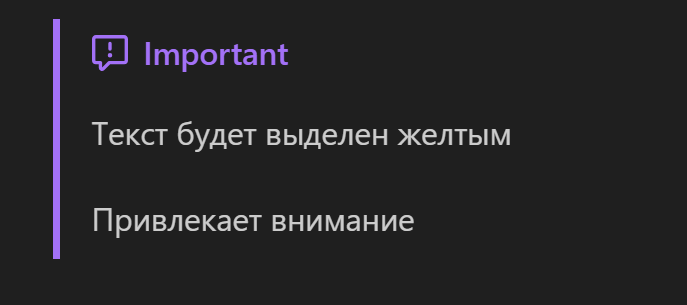
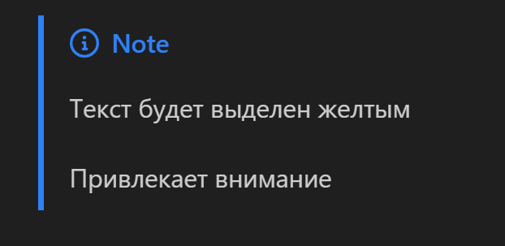
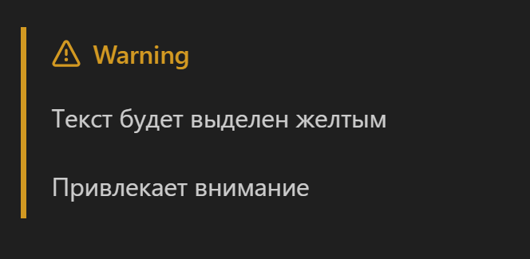
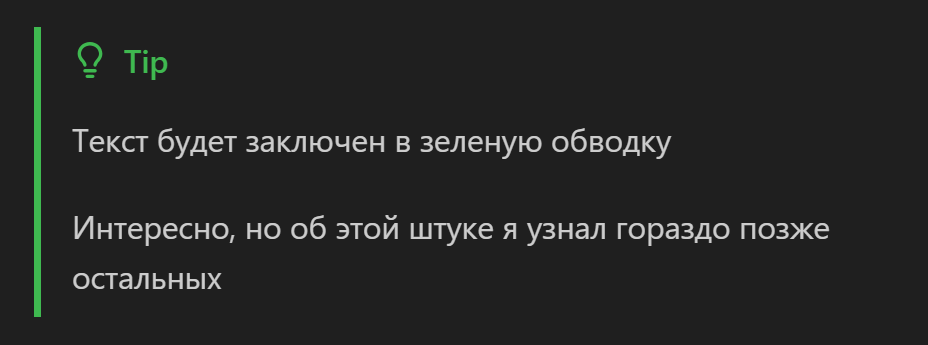
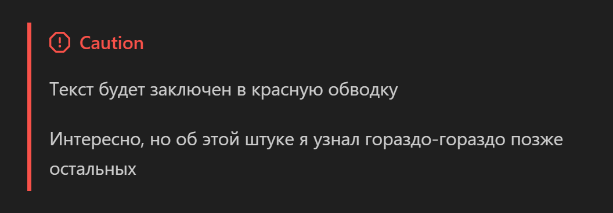
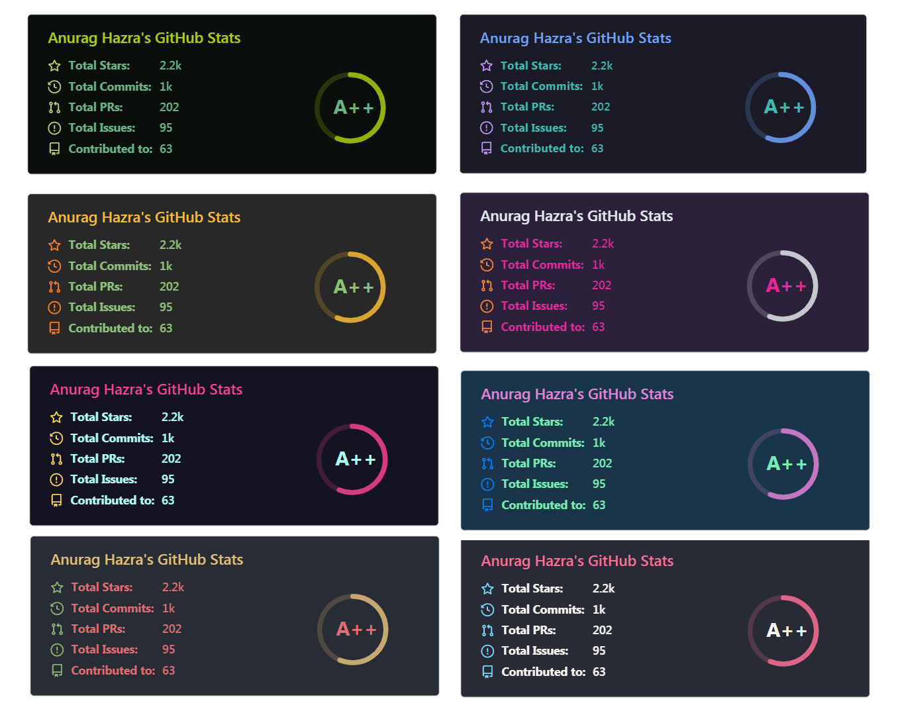

<head>
    <script src="https://cdn.jsdelivr.net/npm/mathjax@3/es5/tex-mml-chtml.js"></script>
</head>


# **MarkDown**

Язык текстовой разметки

<br>

## Содержание

1. [Введение](./Markdown.md#введение)
2. [Основы разметки](./Markdown.md#основы-разметки)
3. [Расширенная разметка](./Markdown.md#расширенная-разметка)
   - [Расширенное цитирование](./Markdown.md#расширенное-цитирование)
   - [Плашка с информацией о профиля GitHub](./Markdown.md#таблицы-активности)
4. [Интеграция с html](./Markdown.md#интеграция-с-html)
5. [Проблемы с использованием на GitHub Pages](./Markdown.md#проблемы-с-использованием-на-github-pages)

<br>

## Введение

**Markdown** — язык текстовой разметки, созданный писателем и блогером Джоном Грубером. Он предназначен для создания красиво оформленных текстов в обычных файлах формата TXT. Вам не нужны громоздкие процессоры вроде Word или Pages, чтобы создавать документы с жирным или курсивным начертанием, цитатами, ссылками и даже таблицами. Достаточно запомнить простые правила Markdown, и можно писать хоть в «Блокноте». Собственно, даже этот абзац (да и весь репозиторий) написаны на markdown. 

Markdown очень удобен не только в качестве языка разметки документов, но еще и в качестве ведения основных групп конспектов. Так, например, сервис для ведения заметок - Obsidian (аналог notion, но с репозиториями на внешних облачных сервисах) целиком и полностью работает на Markdown разметке.

README файлы к репозитория GitHub пишутся как раз на markdown. Мало, кто из начинающих разработчиков уделяет время на написание описания, какого-то комментирования кода в ТЗ или просто в README, а это ведь очень хорошая практика, которая помогает выработать какую-то стабильную структурность в коде и в построении проектов в целом.

<br>

---

## Основы разметки

Как и в случае с html (который является языком гипертекстовой разметки страниц),  в markdown есть свои теги, которые обозначают разметку. Хотя сложно назвать эти ключевые конструкции тегами, но в целом суть ясна:

1. **Форматирование текста**:
   ```markdown

    **Жирный текст**
    *Курсивный текст*
    ~~Зачеркнутый текст~~

    `Выделеный текст`

    <u>Подчеркнутый текст</u>


   ```

   Причем можно сразу обледенить несколько стилей для текста и одновременно иметь подчеркнутый и курсивный текст.

   Списки можно формировать следующим образом:

   - пример 1.1
   - пример 1.2
   - пример 1.3

    ```markdown

    - пример 1.1
    - пример 1.2
    - пример 1.3
    
    ```

    - [ ] пример 2.1
    - [x] пример 2.2
    - [x] пример 2.3
    
    ```markdown

    - [ ] пример 2.1
    - [x] пример 2.2
    - [x] пример 2.3
    
    ```


2. **Вставка (изображения, гиперссылки куски кода и т.д)**:
    Для вставки изображение необходимо иметь либо путь к локальному изображению на компьютере, либо же просто ссылку на него в интернете:

    ```markdown

    

    ```

    Для создания гиперссылок используется похожий принцип:

    ```markdown

    [ссылка](ссылка/на/что-то)

    ```

    В целом, можно даже ссылаться на какие-то отдельные главы и заголовки текущей или другой страницы.

    Чтобы вставить какой-то кусок кода с некоторой подсветкой, то необходимо использовать следующую конструкцию:

    ```markdown

        ```python
            print("hello")
        ```

    ```

    В этом примере создаться блок с кодом и python подсветкой. Можно  использовать разные языки программирования, например, java, c++, js и т.д. Если ничего не указать, то подсветки синтаксиса просто не будет.

    Иногда требуется использовать специфичные формулы и выражения, возможно математического характера, тогда на помощь приходит *LaTeX*. 
    
    > [!NOTE]
    > **LaTeX** — это система компьютерной верстки, которая позволяет сосредоточиться на содержимом документа.
    >
    > Вместо ручного распределения текста или формулы по странице, как в других текстовых редакторах, можно просто вводить их, позволив LaTeX заняться остальным.
    >
    > LaTeX необходим студентам, аспирантам, преподавателям, учёным и любым другим специалистам, для которых важна корректность отображения любых данных.

    И, о какая удача, markdown поддерживает интеграцию с LaTeX конструкциями:

    $$
        \omega_{1} = \frac{V_{1}}{R_{1}^2}
    $$

    ```markdown

    $$
        \omega_{1} = \frac{V_{1}}{R_{1}^2}
    $$

    ```

    > [!IMPORTANT]
    > В контексте LaTeX работа с markdown может быть не совсем уместной, однако даже в самом начале (в заголовке файла) прописать ряд специальных библиотек, которые будут 


  
3. **Таблицы**:
   
    Таблицы максимально не удобный формат в markdown. Красивый, эффектный, но максимально неудобный

    First Header  | Second Header
    ------------- | -------------
    Content Cell  | Content Cell
    Content Cell  | Content Cell

    Выше указан пример таблицы, а вот его код:

    ```markdown
    
    First Header  | Second Header
    ------------- | -------------
    Content Cell  | Content Cell
    Content Cell  | Content Cell

    ```

    Причем мы может управлять элементами выравнивания. По умолчанию стоит выравнивание по середине, но если в заголовках столбцов прописывать:

    `:----` Выравнивание по левому краю;
    `:---:` Выравнивание по центру;
    `----:` Выравнивание по правому краю.

    Вроде бы понятно, но лично у меня всегда возникает вопрос построения таблиц

4. **Цитаты**:

    Цитаты - это одна из тех вещей, которые можно использовать в markdown, но так ли они нужны? На практике я использовал элюенты цитирования всего пару раз в жизни. Кто-то находит эти конструкции очень удобными:

    > Пример обычного цитирования

    ```markdown

    > Пример обычного цитирования

    ```

    > Пример вложенного цитирования 
    >> Да, кто можно
    >>> И так тоже можно

    ```markdown

    > Пример вложенного цитирования 
    >> Да, кто можно
    >>> И так тоже можно

    ```

5. **Выпадающее меню**:
   
   Выпадающее dropdown мены уже невозможно сделать без html тегов. Про интеграцию html  в markdown я расскажу в следующей главе. Сейчас не стоит в это углубляться, можно просто смотреть на результат:

   <details>
   <summary>Отображаемое название</summary>
    Основной тип интегрированного контента выпадающего меню.
   </details>

    <br>

   ```markdown

    <details>
   <summary>Отображаемое название</summary>
    Основной тип интегрированного контента выпадающего меню.
   </details>

   ```

<br>

---

## Расширенная разметка

Базовой разметки обычно хватает для стандартных функциональных требований к проектам.
Если же хочется как-то выделиться среди скучных и обычных MarkDown файлов, можно использовать различные API от комьюнити или расширенные варианты markdown:

### Расширенное цитирование

#### Важное



```markdown
> [!IMPORTANT]
> Текст будет выделен желтым
> 
> Привлекает внимание
```

#### Запись



```markdown
> [!NOTE]
> Текст будет выделен желтым
> 
> Привлекает внимание
```

#### Внимание



```md
> [!WARNING]
> Текст будет выделен желтым
> 
> Привлекает внимание
```

#### Совет



```md
> [!TIP]
> Текст будет заключен в зеленую обводку
>
> Интересно, но об этой штуке я узнал гораздо позже остальных

```

#### Предупреждение



```md
> [!CAUTION]
> Текст будет заключен в красную обводку
>
> Интересно, но об этой штуке я узнал гораздо-гораздо позже остальных
```

### Таблицы активности

Листая, в очередной раз, github профили людей я наткнулся на одну интересную плашку с активностью и оценкой активности пользователя.



Казалось бы, что в обычных проектах, кроме как при представлении эту функцию не использовать, но она может быть очень полезной в тех случаях, когда разработчик пишет описание своего профиля на GitHub

```md

```


> [!NOTE]
> Для создания своего оформления профиля на GitHub все что нужно сделать - это создать репозиторий с названием нашего профиля на GitHub
>
> В моем случае это `voronov-nikita`
>
> Это же имя нужно будет заменить в ссылке на API.

Более подробно вы можете узнать [здесь](https://github.com/anuraghazra/github-readme-stats)

---

<br>


## Интеграция с html

HTML является языков гипертекстовой разметки, что означает, что он предназначен для создания документов, описывающих неявные параметры через схему тегов и конструкций вложенных тегов.

Особенностью markdown документов является то, что он поддерживает некоторый html теги напрямую. Однако можно встретить некоторые баги в виде того, что markdown текст после неправильной вставки может, так скажем, сломаться и отображаться некорректно.

Примеры интеграций:

```html

Перенос на новую стоку:

br>

Жирный, курсивный, подчеркнутый текст:

b> Жирный текст /b>
i> Курсивный текст /i>
u> Подчеркнутый текст /u>
```

Наверное это все основные html теги, которые чаще всего встречаются при работе с markdown документами. Никто не запрещает работать с другими тегами, но вопрос эффективности таких манипуляций остается открытым.

## Проблемы с использованием на GitHub Pages

Как уже несколько раз было сказано, GitHub Pages предоставляет возможность выкладывать ваши статьи или заметки на markdown в форме автоматически оптимизированных под разные устройства сайт. Однако, есть некоторые ограничения, которые необходимо учитывать при работе с markdown на GitHub. Так, например, не всегда удается использовать какие-нибудь LaTeX формулы и выражения, но эта проблема, в целом, легко решается подключением некоторых библиотек и плагинов в заголовке статьи. Вот так:

```markdown

<head>
    <script src="https://cdn.jsdelivr.net/npm/mathjax@3/es5/tex-mml-chtml.js"></script>
</head>

```

И тогда все начинает прекрасно работать.

<br><br>
<br><br>


###### 09.12.2024

