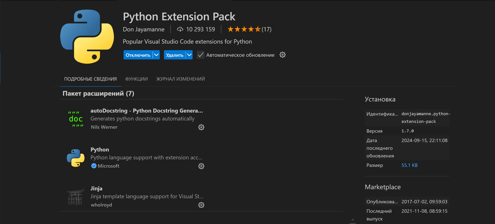

# Visual Studio Code

> [!NOTE]
> Кто-то любит, кто-то ненавидит, все у все индивидуально.
>
> Лично мне ничто не заменит Visual Studio Code в качестве среды разработки.

<br>

## Содержание

1. [Введение](./VSCode.md#введение)
2. [Горячие клавиши](./VSCode.md#горячие-клавиши)
3. [Подготовка среды для разных языков программирования](./VSCode.md#подготовка-среды-для-разных-языков-программирования)
    * [Python](./VSCode.md#python)
    * [C++](./VSCode.md#с)
    * [C#](./VSCode.md#с-1)
    * [Java](./VSCode.md#java)
4. [Полезные расширения](./VSCode.md#полезные-расширения)
5. [Полезные ссылки и источники](./VSCode.md#полезные-ссылки-и-источники)

---

<br>

## Введение

В современном IT мире существует неописуемо много IDE, специализирующихся на разных задачах. Так, например, существует *PyCharm* для написания проектов на Python или *Android Studio*, которая отлично подходит для разработки приложений на Java или Kotlin.

Но что делать, если хочется иметь наиболее универсальный инструмент редактирования кода, чтобы можно было одновременно просматривать исходники C++ и запускать Python-скрипты?

Можно воспользоваться невероятно удобным инструментом редактирования кода - *Visual Studio Code*. 

Visual Studio Code (VS Code) — текстовый редактор, разработанный Microsoft для Windows, Linux и macOS. Позиционируется как «лёгкий» редактор кода для кроссплатформенной разработки веб- и облачных приложений. Редактор поддерживает множества языков программирования: подсветка синтаксиса, автоматическое исправление ошибок, отладка и запуск кода на некоторых языках. Программа распространяется бесплатно. Разрабатывается как программное обеспечение с открытым исходным кодом, но готовые сборки распространяются под проприетарной лицензией.

Более того в само приложение можно добавлять различные расширения, которые могут добавлять новые функции, например, особую подсветку синтаксиса или особый стиль иконок.

---

<br>

## Горячие клавиши

Для упрощения и ускорения работы с программами разработчики вводят ряд "горячих клавиш", которые делают процесс пользования ПО еще более приятным. Вот пример некоторых таких клавиш, стоящих по умолчанию, для VS code:

| **Горячая клавиша**    | **Описание**                           | **Название**               |
|---------------------|------------------------------------|------------------------|
| `Ctrl + P`          | Быстрый переход к файлу           | Быстрый доступ         |
| `Ctrl + Shift + P`  | Открыть командную палитру         | Командная палитра      |
| `Ctrl + ,`          | Открыть настройки                 | Настройки              |
| `Ctrl + B`          | Показать/скрыть боковую панель    | Боковая панель         |
| `Ctrl + K Ctrl + S` | Открыть настройки горячих клавиш  | Горячие клавиши        |
| `Ctrl + N`          | Создать новый файл                | Новый файл             |
| `Ctrl + W` или `Ctrl + F4`         | Закрыть текущий редактор          | Закрыть редактор       |
| `Ctrl + Shift + T`         | Восстановить  последний закрытый редактор | Восстановить редактор |
| `Ctrl + K Ctrl + W` | Закрыть все открытые редакторы    | Закрыть все            |
| `Ctrl + S`          | Сохранить файл                    | Сохранить файл         |
| `Ctrl + Shift + S`  | Сохранить файл как                | Сохранить как          |
| `Ctrl + Z`          | Отменить действие                 | Отмена                 |
| `Ctrl + Y`          | Повторить действие                | Повтор                 |
| `Ctrl + C`          | Копировать                       | Копировать             |
| `Ctrl + X`          | Вырезать                          | Вырезать               |
| `Ctrl + V`          | Вставить                          | Вставить               |
| `Ctrl + F`          | Найти                             | Поиск                  |
| `Ctrl + H`          | Найти и заменить                  | Замена                 |
| `Ctrl + G`          | Перейти к строке                  | Перейти к строке       |
| `Ctrl + K Ctrl + U` | Преобразовать в верхний регистр   | Верхний регистр        |
| `Ctrl + K Ctrl + L` | Преобразовать в нижний регистр    | Нижний регистр         |
| `Alt + Arrow`       | Переместить строку вверх/вниз     | Перемещение строки     |
| `Ctrl + /`          | Переключить строковый комментарий | Строковый комментарий  |
| `Shift + Alt + A`   | Переключить блочный комментарий   | Блочный комментарий    |
| `Ctrl + ]`          | Увеличить отступ                  | Увеличить отступ       |
| `Ctrl + [`          | Уменьшить отступ                  | Уменьшить отступ       |
| `F11`               | Включить/выключить полноэкранный режим | Полноэкранный режим    |
| `Ctrl + Shift + M`  | Открыть панель проблем            | Панель проблем         |
| `Ctrl + Shift + E`  | Открыть проводник                 | Проводник              |
| `Ctrl + Shift + G`  | Открыть управление исходным кодом | Исходный код           |
| `Ctrl + Shift + D`  | Открыть отладку                   | Отладка                |
| `Ctrl + Shift + X`  | Открыть расширения                | Расширения             |
| `Ctrl + Tab`        | Переключение между редакторами    | Переключение редакторов|
| `Ctrl + \`          | Разделить редактор                | Разделить редактор     |
| `F5`                | Запустить отладку                | Запуск отладки         |
| `Ctrl + Shift + U`  | Показать панель вывода            | Панель вывода          |
| `Ctrl + Shift + C`  | Открыть встроенный терминал       | Терминал               |
| `Ctrl + Shift + '`  | Создать новый терминал            | Новый терминал         |


---

<br>

## Подготовка среды для разных языков программирования

Как уже упоминалось несколько раз, для того чтобы открыть возможность работать с несколькими языками программирования , необходимо установить соответствующие расширения и, в некоторых случаях, настроить виртуальную среду операционной системы. Для разных языков программирования могут потребоваться разные расширения и настройки. Вот пример наиболее популярных решений для наиболее популярных инструментов:

### **Python**

Ситуация с python не то чтобы сложная, она скорее может вызвать несколько вопросов если сделать что-то не так.

Для начала можно установить расширение `Python` в редакторе, которое позволит работать с Python, подсветит синтаксис и, возможно, откроет некоторые преимущества для конкретных фреймворках.



> [!NOTE]
>
> Можно попробовать "убить 2-х зайцев одним ударом" и установить готовый набор расширений для разработки на python, но в нем может не быть всех необходимых функций, которые вы хотите использовать.

После установки следует проверить установлен ли сам Python в переменную сред окружения ОС. В случае Linux очевидно, т.к python встроен в него по умолчанию, а в случает с Widows сложнее. Можно установить Python с помощью `pyenv` или `conda` и указать путь к нему в переменных среды, а можно установить с помощью готового загрузчика с официального сайта.

> [!IMPORTANT]
>
> Важно, что если python устанавливается с помощью архиватора с официального сайта, нужно обязательно поставить галочку возле флажка "Добавить в переменные среды" (Add to Path) при установке, 
> иначе python не будет доступен с терминала, а значит и расширение vs code его не увидит.

Готово!

Теперь мы имеем возможность работать с Python в редакторе VS Code. Создадим новый файл с расширением `.py` и начнем писать наш код. Редактор будет подсвечивать синтаксис языка, делать подсказки. После написания кода можно нажать на кнопку "Run" в верхнем правом углу и запустить код. 

Если же вариант запуска кода через кнопку не работает, то можно зайти в терминал в выполнить команду:

```bash
python main.py
```

Где `main.py` - это название нашего файла с кодом. 
В терминале выведется результат работы программы.

<br>

### **С++**

Работы с C++ в Visual Studio Code не то чтобы до конца удобна, но иногда выходит куда лучше того, 
что предоставляет стандартный Visual Studio. Разумеется, что без проблем не обойдется, к примеру есть
момент, что используется компилятор Linux, из-за чего некоторые библиотеки и зависимости могут работать
не совсем так, но все взаимозаменяемо.

Можно следовать гайду в [этой статье](https://code.visualstudio.com/docs/languages/cpp)

Кратко что нужно делать:

1. Устанавливаем [эту программу](https://www.msys2.org/)
2. Открываем ее и копируем эту команду:
   
   ```bash
   pacman -S --needed base-devel mingw-w64-ucrt-x86_64-toolchain
   ```

3. Расширяем переменные среды до пути нашего компилятора (обычно это `msys64\ucrt64\bin`)
4. Устанавливаем расширение в vs code для C++
5. Устанавливаем расширение "Runner" для запуска C++ кода с помощью дебагера
   
Готово! Можно тестировать.

### **С#**

Установка C# происходит ровно точно так же, как это было с [Python](./VSCode.md#python), 
за исключением того что нужно установить не python компилятор, а [*.Net*](https://dotnet.microsoft.com/ru-ru/)  

### **Java**

Как установить Java? - Да точно так же! Ничего нового.

---

<br>

## Полезные расширения
 
1. **Russian Language Pack for Visual Studio Code** - смена стандартного языка интерфейса (английского) на русский
2. **Material Icon** - для красивых иконок
3. **Prettier** - для форматирования кода
4. **BLACKBOXAI** - для автодополнения
5. **Code Runner** - для запуска кода разных языков
6. **Code Spell Checker** - для проверки орфографии (в том числе и русской)
7. **IntelliCode** - для подсказок при наборе кода
8. **Live Server** - для запуска сервера разработки web страниц (удобно при разработке статичных сайтов на HTML и CSS)
9. **Remote - SSH** - для удаленного доступа к серверам по технологии SSH
10. **SQLite Viewer** - для просмотра баз данных SQLite
11. **vscode-pdf** - для просмотра PDF файлов
12. **C/C++** - подсветка синтаксиса для C и C++ языков программирования
13. **Extensible Markdown** - удобный конвертер Markdown разметки в HTML
14. **Pep/8 Assembly HighlighterPreview** - форматирование кода по стандарту PEP8 (часто используется в связке с python)
15. **indent-rainbow** - для красивой подсветки разного уровня отступов


> [!NOTE]
> Всеми этими расширениями пользуюсь я лично, но разумеется, что у них есть свои аналоги,
> которые могут быть в чем-то лучше, в чем-то хуже

---

<br>

## Полезные ссылки и источники

1. [Официальный сайт VS Code](https://code.visualstudio.com/)
2. ["Material Icon Them" - marketplace.visualstudio.com](https://marketplace.visualstudio.com/items?itemName=PKief.material-icon-theme)
3. ["Code Runner" - marketplace.visualstudio.com](https://marketplace.visualstudio.com/items?itemName=formulahendry.code-runner)
4. ["Prettier - Code formatter" - marketplace.visualstudio.com](https://marketplace.visualstudio.com/items?itemName=esbenp.prettier-vscode)
5. ["Remote - SSH" - marketplace.visualstudio.com](https://marketplace.visualstudio.com/items?itemName=ms-vscode-remote.remote-ssh)
6. ["vscode-pdf" - marketplace.visualstudio.com](https://marketplace.visualstudio.com/items?itemName=tomoki1207.pdf)
7. ["BLACKBOXAI #1 Coding Agent +10 Million Developers" - marketplace.visualstudio.com](https://marketplace.visualstudio.com/items?itemName=Blackboxapp.blackbox)
8. ["Live Server" - marketplace.visualstudio.com](https://marketplace.visualstudio.com/items?itemName=ritwickdey.LiveServer)
9. ["Code Spell Checker" - marketplace.visualstudio.com](https://marketplace.visualstudio.com/items?itemName=streetsidesoftware.code-spell-checker)
10. [Установка C++ в Visual Studio Code](https://code.visualstudio.com/docs/languages/cpp)
11. ["Почему VS Code лучший инструмент программиста?" - youtu.be](https://youtu.be/9QxY5zIoTgc?si=0zLwLtVj4bGchJbY)
12. ["ТОП-10 Полезных Плагинов для VS Code, которые облегчат жизнь веб-разработчикам" - youtu.be](https://youtu.be/xFQG4fEc4jc?si=FpNgX0uIxljzQYyb)
13. ["VS Code, python, контейнеры — как обуздать эту триаду и разрабатывать внутри контейнера" - habr.com](https://habr.com/ru/companies/ruvds/articles/717110/)
14. ["Настройка Visual Studio Code для Django" - habr.com](https://habr.com/ru/articles/701800/)
15. ["Настройка Visual Studio Code для Python" - selectel.ru](https://selectel.ru/blog/tutorials/how-to-configure-visual-studio-code-for-python/)
16. ["С/С++ на Linux в Visual Studio Code для начинающих" - habr.com](https://habr.com/ru/companies/microsoft/articles/333680/)
17. ["Как настроить Visual Studio Code на работу с С++?" - ru.stackoverflow.com](https://ru.stackoverflow.com/questions/1172843/Как-настроить-visual-studio-code-на-работу-с-С)
18. ["Как настроить VSCode под C/C++ \| How to tune Visual Studio Code for C/C++" - rutube.ru](https://rutube.ru/video/85156a65f50fc307c8024f8cee362405/?r=plwd)
19. ["Настройка Visual Studio и Visual Studio Code под C#" - youtu.be](https://youtu.be/9XYwm2GOQtk)

---

<br><br>
<br><br>

###### 01.01.2025

