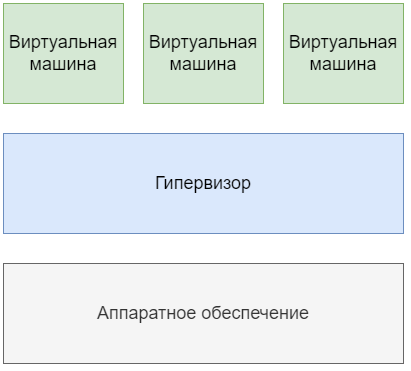
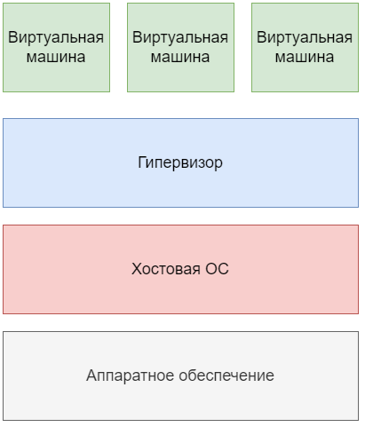
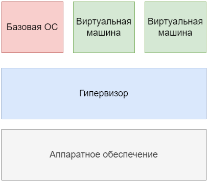

# **Виртуализация**

## Введение

Много лет назад, когда вычислительные мощности компьютеров и ЭВМ были куда ниже и менее доступны простым пользователям, люди начали искать способы использовать имеющиеся ресурсы более эффективно, а возможно и даже получить то, чего у них в принципе нет. Так появилась концепция <u>виртуализации оборудования</u>.

**Виртуализация** — это построение вычислительной среды, в которой на базе одних и тех же аппаратных ресурсов работает множество изолированных друг от друга виртуальных машин. Другими словами, это создание программных версий различных физических объектов: компьютеров, хранилищ данных, сетей, серверов и приложений. В основе виртуальной вычислительной среды лежит гипервизор — программа, которая распределяет аппаратные ресурсы между виртуальными машинами.

Пользователи могут подключаться к гостевым ОС с помощью специальных устройств ввода-вывода – терминалов.

Виртуализация обладала существенными преимуществами над концепцией разделения времени:

- Увеличенные надежность и безопасность за счет изоляции пользователей.

- Запуск любых приложений (не только приспособленных к концепции разделения времени) за счет симуляции отдельного компьютера для каждого пользователя.

- Увеличенная производительность за счет использования легковесных гостевых ОС.

## Основные понятия

Существует много видов виртуализации, однако можно выделить три основных:

1. Аппаратная виртуализация:
    Позволяет создавать независимые и изолированные друг от друга виртуальные компьютеры с помощью программной имитации ресурсов (процессора, памяти, сети, диска и др.) физического сервера. Физический сервер называют хостовой машиной или хостом, виртуальные компьютеры – виртуальными машинами. Программное обеспечение, которое создает виртуальные машины и управляет ими, называют гипервизором. На практике на виртуальных машинах могут использоваться разные ОС для разных целей – например, Windows Server под контроллер домена Active Directory и Debian под веб-сервер NGINX.
2. **Виртуализация рабочих столов:**
    Позволяет отделить логический рабочий стол от физической инфраструктуры. Одной из наиболее распространенных форм виртуализации рабочих столов является VDI (Virtual Desktop Infrastructure) – инфраструктура виртуальных рабочих столов. Каждый пользователь VDI имеет программную имитацию ОС с необходимым набором программ на физическом сервере под управлением гипервизора и может подключаться к ней по сети. На практике VDI может использоваться для работы большого количества сотрудников на «удаленке» для того, чтобы не закупать им отдельные рабочии станции и управлять инфраструктурой централизованно.

3. **Виртуализация на уровне ОС (контейнеризация):**
    Позволяет запускать программное обеспечение в изолированных на уровне операционной системы пространствах. Наиболее распространенной формой виртуализации на уровне ОС являются контейнеры (например, Docker). Контейнеры более легковесны, чем виртуальные машины, так как они опираются на функционал ядра ОС и им не требуется взаимодействовать с аппаратным обеспечением. На практике контейнеры представляют из себя изолированную среду для запуска любого приложения со всеми его зависимостями и настройками.

## Виртуализация серверов

**Виртуализация серверов** – это процесс разделения физического сервера на несколько уникальных и изолированных виртуальных машин (серверов) с помощью программного обеспечения (гипервизора). На каждом виртуальном сервере могут независимо выполняться собственные операционные системы.

Виртуализация серверов позволяет:

- Оптимизировать затраты на покупку серверного оборудования.
    Под каждую задачу выделяется виртуальный сервер с необходимым количеством ресурсов (ЦПУ, ОЗУ и др.), простои оборудования минимизируются.

- Упростить сопровождение инфраструктуры.
    Создание, удаление или обслуживание виртуальной машины как правило проще и быстрее, чем аналогичные операции с физическим сервером.

- Повысить отказоустойчивость инфраструктуры.
    Виртуальные машины изолированы друг от друга, программный сбой на одной из них не приведет к потере работоспособности сервисов и приложений на остальных.

 

Гипервизор обеспечивает параллельное и независимое  функционирование нескольких операционных систем на одном компьютере. В классическом подходе гипервизоры группируются по двум типам: гипервизоры первого типа запускаются непосредственно на аппаратном обеспечении компьютера, а гипервизорам второго типа для работы необходимо наличие хостовой операционной системы. В последние несколько лет классическая классификация претерпевает изменения – добавился гибридный тип гипервизоров, который сочетает характеристики первого и второго типов.
Удобно!

Гипервизор 1-го типа:

Гипервизор 2-го типа:

Гипервизор 3-го типа:

  

###### 16.10.2024