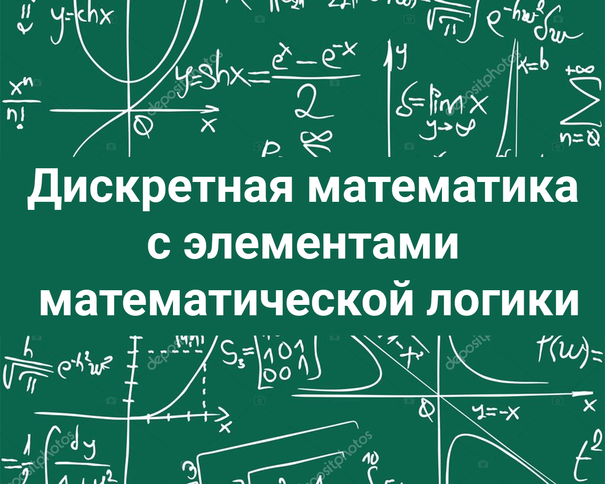

<head>
    
</head>

# Дискретная математика

## Введение

Дискретная математика - это раздел математики, которую стабильно никто не понимает...

Ладно, а если серьезно, то **Дискретная математика** — это раздел математики, изучающий свойства дискретных структур, которые возникают как в самой математике, так и в её приложениях. 

В свою очередь *Дискретные структуры* — это объекты, для которых важнейшие характеристики принимают конечное или счётное число значений. К числу таких структур относятся, например: конечные группы, конечные графы, некоторые математические модели преобразователей информации, конечные автоматы.

В широком смысле к дискретной математике могут быть отнесены такие разделы математики, как теория чисел, теория множеств, алгебра, математическая логика и прочие.
В отличие от традиционной математики, методы и конструкции которой имеют в основном числовую интерпретацию, дискретная математика имеет дело с объектами нечисловой природы: множествами, логическими высказываниями, полиномами, графами. 

## Содержание по темам (лекции)

1. [Комбинаторика]()
2. [Булевы операции. Булева логика. Множества, наборы и т.д]()
3. [Булевы функции. Базисы]()
4. [Булевы пространства. Полином Жегалкина]()
5. [СДНФ и СКНФ]()
6. [Классы Поста. Замыкание системы]():
   
   - [Класс сохраняющий 0: $$ T_{0} $$]()
   - [Класс сохраняющий 1: $$ T_{1} $$]()
   - [Класс Линейных: $$ L $$]()
   - [Класс самодвойственных: $$ S $$]()
   - [Класс монотонных: $$ M $$]()

7. [Теорема о полноте функции. Критерий Поста]()
8. [Графы]()
9.  [Однозначное кодирование графов]()

## Практические примеры

1. [Построение полинома Жегалкина]():
   - [Метод неопределенные коэфицентов]()
   - [Метод "треугольника"]()
2. [Определение СДНФ и СКНФ]()
3. [Определение полноты заданной функции]()
4. [Выделение базиса функции]()
5. [Кодирование и декодирование графа]()

## Полезные ссылки

1.  
2.  
3.  

  
  

###### 02.11.2024