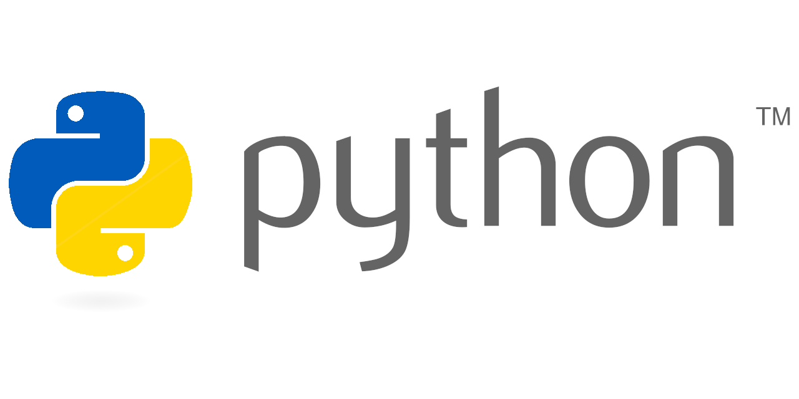

# **Python**

### База в теории

1. [База данных SQLite3](./sqlite3.md)
2. [Теория по библиотеке sqlite3 python](./sqlite3.md)
3. [Flask](./flask/)
4. [matplotlib - построение графиков на python](./matplotlib/)
5. [numpy - библиотека массивов и векторов в python](./numpy/)
6. [База по PyQt5](./pyqt5/)
7. [Вариант формы авторизации на PyQt5](./pyqt5/PyQt5-auth.md)
8. [Построение таблиц с помощью PyQt5](./pyqt5/PyQt5-table.md)
9. [Построение графиков с помощью PyQt5](./pyqt5/PyQt5-graphics.md)
10. [Написание ТГ бота на python](./telebot.md)

### Интересные задачи и решения к ним

1. [Решение задачи интерпритатор с олимпиады и сайта CodeWars](./tasks.md)

###### 08.11.2024