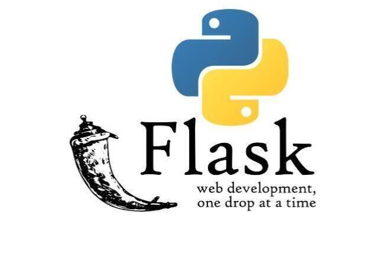

# **Методическое пособие по python Flask**

## **Содержание**

1. [Введение](./README.md#введение)
   * [О Flask](./README.md#о-flask)
   * [Установка](./README.md#установка)
2. [Записи](./README.md#записи)
   * [Основы Flask](./base.md)
   * [Flask сайты](./flask-sait.md)
   * [Flask на REG.RU](./flask-regru.md)
   * [Flask для серверов](./servers.md)
   * [База данных во Flask](./flask-database.md)
   * [Примеры проектов на Flask](./projects.md)
3. [Полезный ссылки](./README.md#полезные-ссылки)

<br>

## **Введение**

### О Flask

**Flask** — это микрофреймворк для создания веб-приложений на языке программирования Python.

Приставка «микро» означает, что инструмент предоставляет минимальный набор функций. 
Чтобы получить доступ к дополнительным возможностям, нужно подключить сторонние плагины и библиотеки.

Flask позволяет создавать сайты любой сложности: от одностраничных лендингов до интернет-порталов и маркетплейсов. 
Примеры применения: разработка небольших сервисов, создание приложений на основе микросервисной архитектуры, быстрое прототипирование, разработка API-серверов и RESTful-систем.

Создатель и основной автор — австрийский программист Армин Ронахер. 
Начал работу над проектом в 2010 году.

### Установка 

Как и любую другую библиотеку, можно установить с помощью pip:

```bash
pip install flask
```

После этого можно попробовать импортировать библиотеку из виртуального окружения в python файл и запустить.

<br>

## **Записи**

1. [Основы Flask](./base.md)
2. [Flask сайты](./flask-sait.md)
3. [Flask на REG.RU](./flask-regru.md)
4. [Flask для серверов](./servers.md)
5. [База данных во Flask](./flask-database.md)
6. [Примеры проектов на Flask](./projects.md)

<br>

## **Полезные ссылки**

1. [Flask (веб-фреймворк) - wikipedia.org](https://ru.wikipedia.org/wiki/Flask_(веб-фреймворк))
2. [Официальный сайт python библиотеки - pypi.org](https://pypi.org/project/Flask/)
3. [Официальная документация - flask.palletsprojects.com](https://flask.palletsprojects.com/en/stable/)
4. [Фреймворк Flask: как он работает и зачем нужен - skillbox.ru](https://skillbox.ru/media/code/freymvork-flask-kak-on-rabotaet-i-zachem-nuzhen/)
5. [Flask для начинающих - habr.com](https://habr.com/ru/articles/783574/)


<br><br>
<br><br>

###### 03.12.2024