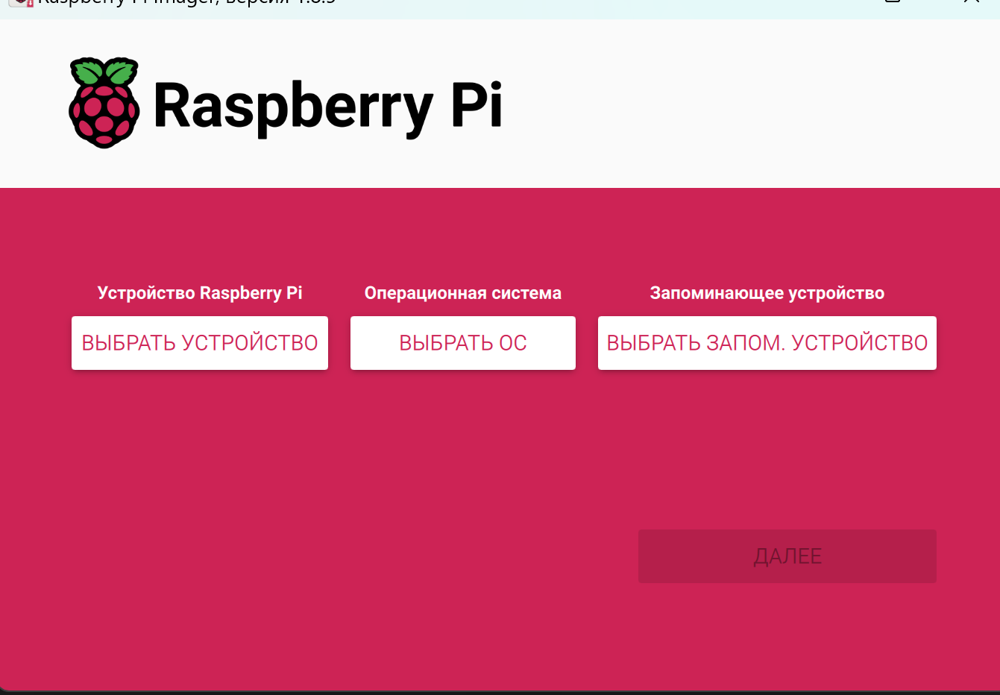
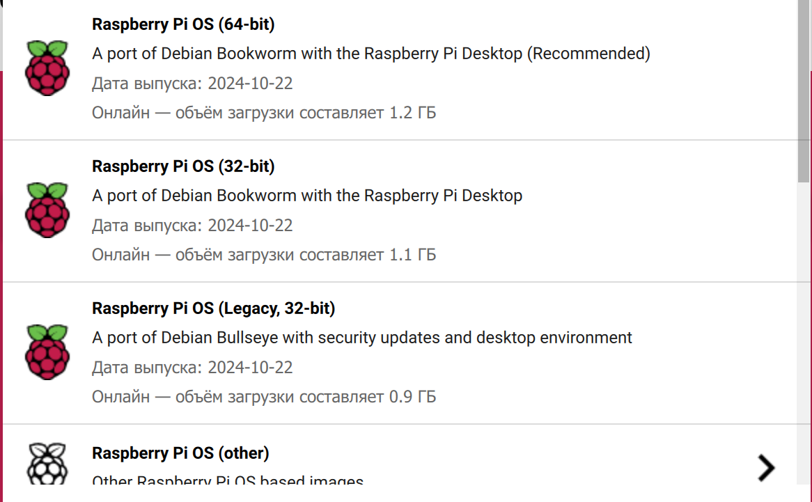
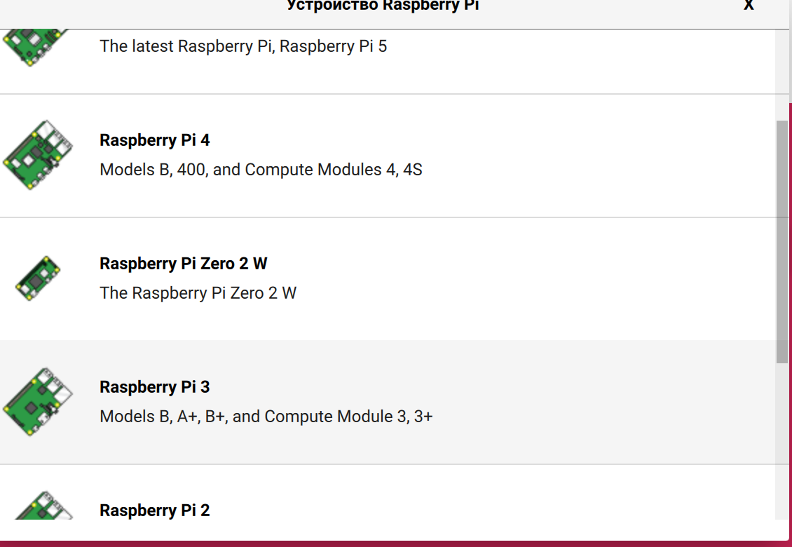
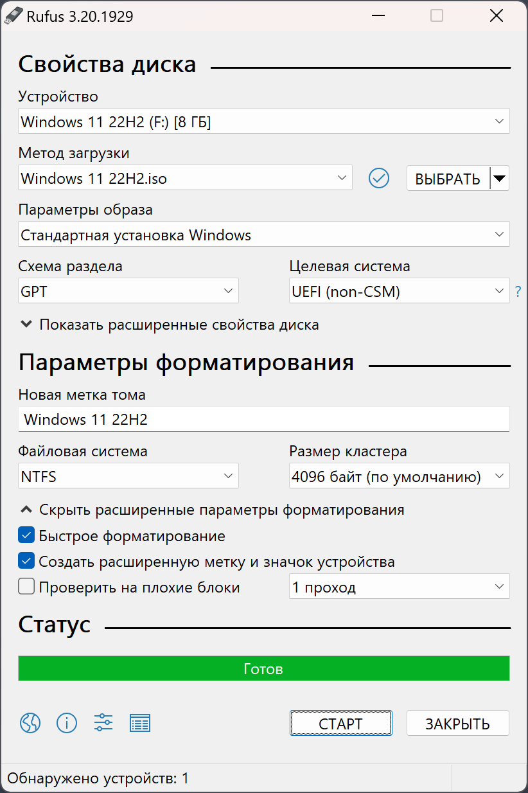

# **Raspberry Pi**

## Содержание

1. [Введение](./README.md#введение)
2. [Работа с микрокомпьютером](./README.md#работа-с-микрокомпьютером)
   - [Выбор ОС](./README.md#выбор-ос)
   - [Установка ОС](./README.md#установка-ос)
   - [Первый запуск и настройка](./README.md#первый-запуск-и-настойка)
3. [Интересные проекты](./README.md#интересные-проекты)
4. [Полезные материалы](./README.md#полезные-материалы) 

 

## Введение

Raspberry Pi — это одноплатный компьютер размером с банковскую карту, изначально разработанный как бюджетная система для обучения информатике, но позже получивший более широкое применение и известность в DIV проектах и простеньких системах автоматизированного управления.

У него есть процессор, ОЗУ, видеоускоритель, а некоторые вариации обладают множеством полноценных разъёмов, включая USB, Ethernet и microHDMI.

| Модель             | Процессор                  | ОЗУ                 | Интерфейсы                  | Особенности                                     |
|--------------------|----------------------------|---------------------|-----------------------------|-------------------------------------------------|
| **Raspberry Pi 3 Model B**      | Broadcom BCM2837 (4x ARM Cortex-A53) | 1 ГБ LPDDR2       | 4x USB 2.0, HDMI, GPIO, CSI, DSI | Поддержка Wi-Fi 802.11n, Bluetooth 4.1, Ethernet 100 Мбит |
| **Raspberry Pi 3 Model B+**     | Broadcom BCM2837B0 (4x ARM Cortex-A53) | 1 ГБ LPDDR2       | 4x USB 2.0, HDMI, GPIO, CSI, DSI | Улучшенная поддержка Wi-Fi 802.11ac, Bluetooth 4.2, Ethernet 300 Мбит |
| **Raspberry Pi 4 Model B (1GB)**| Broadcom BCM2711 (4x ARM Cortex-A72) | 1 ГБ LPDDR4       | 2x USB 3.0, 2x USB 2.0, 2x micro-HDMI, GPIO, CSI, DSI | Поддержка 4K, до 2-х мониторов, Gigabit Ethernet |
| **Raspberry Pi 4 Model B (2GB)**| Broadcom BCM2711 (4x ARM Cortex-A72) | 2 ГБ LPDDR4       | 2x USB 3.0, 2x USB 2.0, 2x micro-HDMI, GPIO, CSI, DSI | Поддержка 4K, до 2-х мониторов, Gigabit Ethernet |
| **Raspberry Pi 4 Model B (4GB)**| Broadcom BCM2711 (4x ARM Cortex-A72) | 4 ГБ LPDDR4       | 2x USB 3.0, 2x USB 2.0, 2x micro-HDMI, GPIO, CSI, DSI | Поддержка 4K, до 2-х мониторов, Gigabit Ethernet |
| **Raspberry Pi 4 Model B (8GB)**| Broadcom BCM2711 (4x ARM Cortex-A72) | 8 ГБ LPDDR4       | 2x USB 3.0, 2x USB 2.0, 2x micro-HDMI, GPIO, CSI, DSI | Поддержка 4K, до 2-х мониторов, Gigabit Ethernet |
| **Raspberry Pi 5 (4GB)**        | Broadcom BCM2712 (4x ARM Cortex-A76) | 4 ГБ LPDDR4X      | 2x USB 3.0, 2x USB 2.0, 2x micro-HDMI, PCIe, GPIO, CSI, DSI | Поддержка 4K, до 2-х мониторов, PCIe-слот для расширения |
| **Raspberry Pi 5 (8GB)**        | Broadcom BCM2712 (4x ARM Cortex-A76) | 8 ГБ LPDDR4X      | 2x USB 3.0, 2x USB 2.0, 2x micro-HDMI, PCIe, GPIO, CSI, DSI | Поддержка 4K, до 2-х мониторов, PCIe-слот для расширения |

## Работа с микрокомпьютером

### Выбор ОС

Raspberry Pi платы зачастую используют для организации не требовательных, но автоматизированных вычислений с использованием наиболее энергоэффективного ресурса вычислений.

| Операционная система       | Версия                      | Базируется на     | Поддерживаемые архитектуры | Основные особенности                                                 |
|----------------------------|-----------------------------|-------------------|----------------------------|-----------------------------------------------------------------------|
| **Raspberry Pi OS Lite**   | Без графического интерфейса | Debian           | ARMv6, ARMv7, ARM64        | Минимальная установка, экономит ресурсы, подходит для серверных задач |
| **Raspberry Pi OS Desktop**| С графическим интерфейсом   | Debian           | ARMv6, ARMv7, ARM64        | Легковесный интерфейс PIXEL, подходит для настольного использования   |
| **Raspberry Pi OS Full**   | С графическим интерфейсом   | Debian           | ARMv6, ARMv7, ARM64        | Включает дополнительные приложения, офисный пакет, IDE для разработчиков |
| **Ubuntu Server**          | 20.04, 22.04 LTS           | Ubuntu           | ARMv7, ARM64               | Официальная поддержка Canonical, регулярные обновления и патчи       |
| **Ubuntu Desktop**         | 20.04, 22.04 LTS           | Ubuntu           | ARM64                      | Полнофункциональная ОС с графическим интерфейсом GNOME, удобна для повседневных задач |
| **Kali Linux**             | Rolling Release             | Debian           | ARMv7, ARM64               | Специализированная ОС для тестирования безопасности, широкий набор инструментов |
| **CentOS Stream**          | 8, 9 Stream                 | CentOS (RHEL)    | ARM64                      | Стабильная серверная ОС, подходящая для корпоративных приложений      |

### Установка ОС

Для установки выбранной операционной системы рекомендуется использовать специальную программу от компании Raspberry.
Приложение *RaspberryPi Imager* позволяет создать карту microSD с необходимой ОС и установить ее на плату.

Возможными вариантами уже предустановленных программ был представлен выше.

Перед установкой ОС рекомендуется выбрать модель платы, на которой будет работать малинка.

 

И все же, это не единственный способ установки ОС на малинку. Существует ряд других программ, которые являются более универсальными в плане работы с установщиками ОС, как пример, одной из таких программ является *Rufus*.

Rufus предоставляет базовые модели установки ОС, без возможности оптимизации под специальное или специфичное оборудование, однако за счет простоты и понятности схем и принципов работы его часто используют для ускоренной и более ресурсо-емкой установки ОС на различные устройства, включая raspberry pi.

### Первый запуск и настойка

Перед тем, как начать установку *Raspberry Pi Imager* предложит изменить параметры по умолчанию. В частности, можно выбрать язык интерфейса, а также задать имя пользователя, пароль, обеспечить конфигурацию WiFi малинки и первичный доступ по SSH.

> [!NOTE]
> **SSH** (от англ. secure shell ― безопасная оболочка) ― это защищённый сетевой протокол для удалённого управления сервером (в нашем случае микрокомпьютером) через интернет или локальную сеть.

Рекомендуется сразу настроить интерфейс беспроводной связи и доступ по SSH, чтобы облегчить себе жизнь. В противном случае, придется подключать малинку у монитору, клавиатуре и, возможно, мышке. Чаще работа и администрирование происходит с помощью удаленного терминала, которые меньше нагружает ресурсы микрокомпьютера.

## Интересные проекты и способы использовать микрокомпьютер

1. **Умный дом**:
   
   Суть проекта в том, чтобы реализовать локальную связь между умными устройства в пределах одного дома (или даже одной комнаты), причем данные устройства предполагают в себе систему из датчиков и прочих несущих информацию вещей. 
   Например, датчики освещения, термометры, всевозможные камеры и т.д.

   [Подробнее](./SmartHome.md)

2. **Роботы**:
   
   На базе Raspberry можно выстроить не только систему обмена и анализа информации в нескольких потоках, но так же реализовать систему управления движением робота.

   Робот может быть ориентирован больше на работу с машинным зрением или наоборот, делать упор на вычисление сложных математических или физических действий на основе анализа окружающей среды.

   [Подробнее](./Robots.md)

3. **Домашний NAS сервер**:
   
   Ограничение места хранения информации в современных ситуациях не такая глобальная проблема, уже давно существуют множество онлайн платформа для быстрого обмена ссылками на фотографии/видео/прочие файлы. Однако, есть ситуации, когда желательно иметь возможность хранить данные на собственном оборудовании. К примеру для большей конфидециальности или управление большим объемом памяти.

   [Подробнее](./NASServer.md)

4. **Продвинутая система слежения и охраны на базе ИИ**:
   
   Обеспечение безопасности по средствам ИИ, позволяет не только реагировать на конкретные события более оперативным образом, но и предполагает, возможно, более оптимизированную защиту от различных угроз. ИИ может анализировать данные с различных сенсоров или напрямую с камеры и анализировать степень угрозы.

   Так же большим преимуществом может стать отслеживание одного или нескольких людей в определенных условиях или в пределах одного помещения.

   [Подробнее](./SmartSecurity.md)

5. **IoT устройств**:

   Современные дома уже давно заполнены различными устройствами, которыми можно управлять через приложение, через список голосовых команд или быть автоматизированными в условиях работы с интернет ресурсами. Однако что делать, если дома присутствует оборудование, которое не имеет конкретной возможности подключения к интернету или же не имеет возможности управления через приложение?

   Именно в таких случаях можно использовать raspberry в качестве "моста" для реализации управления и связи с интернетом.

   [Подробнее](./IoTDevice.md)

## Полезные материалы

1. [raspberrypi.com](https://www.raspberrypi.com/)
2. [Raspberry Pi для начинающих - edurobots.org](https://edurobots.org/raspberry-pi-dlya-nachinayushhix/)
3. [Raspberry Pi: подробная настройка с нуля до TorrentBox - habr.com](https://habr.com/ru/articles/149890/)
4. [raspberrypi-ru.com](https://raspberrypi-ru.com/учебные-пособия/page/2/)
5. [RaspberryPi проекты - github.com](https://github.com/topics/raspberry-pi-projects)
6. [rufus.ie - официальный сайт](https://rufus.ie/ru/)

  
  

###### 16.11.2024