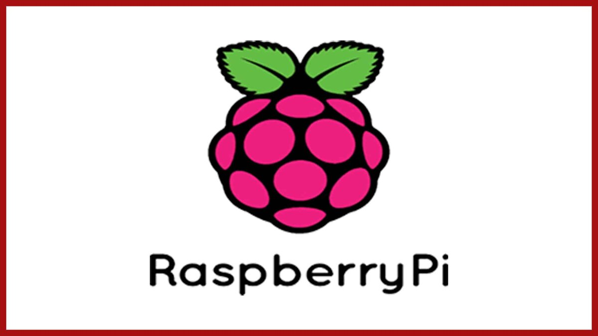

# Raspberry Pi

## Содержание

1. [Введение](./README.md#введение)
2. [Работа с микрокомпьютером](./README.md#работа-с-микрокомпьютером)
   - [Выбор ОС](./README.md#выбор-ос)
   - [Установка ОС](./README.md#установка-ос)
   - [Первый запуск и настройка](./README.md#первый-запуск-и-настойка)
3. [Интересные проекты](./README.md#интересные-проекты)
4. [Полезные материалы](./README.md#полезные-материалы) 

 

## Введение

Raspberry Pi — это одноплатный компьютер размером с банковскую карту, изначально разработанный как бюджетная система для обучения информатике, но позже получивший более широкое применение и известность в DIV проектах и простеньких системах автоматизированного управления.

У него есть процессор, ОЗУ, видеоускоритель, а некоторые вариации обладают множеством полноценных разъёмов, включая USB, Ethernet и microHDMI.

| Модель             | Процессор                  | ОЗУ                 | Интерфейсы                  | Особенности                                     |
|--------------------|----------------------------|---------------------|-----------------------------|-------------------------------------------------|
| **Raspberry Pi 3 Model B**      | Broadcom BCM2837 (4x ARM Cortex-A53) | 1 ГБ LPDDR2       | 4x USB 2.0, HDMI, GPIO, CSI, DSI | Поддержка Wi-Fi 802.11n, Bluetooth 4.1, Ethernet 100 Мбит |
| **Raspberry Pi 3 Model B+**     | Broadcom BCM2837B0 (4x ARM Cortex-A53) | 1 ГБ LPDDR2       | 4x USB 2.0, HDMI, GPIO, CSI, DSI | Улучшенная поддержка Wi-Fi 802.11ac, Bluetooth 4.2, Ethernet 300 Мбит |
| **Raspberry Pi 4 Model B (1GB)**| Broadcom BCM2711 (4x ARM Cortex-A72) | 1 ГБ LPDDR4       | 2x USB 3.0, 2x USB 2.0, 2x micro-HDMI, GPIO, CSI, DSI | Поддержка 4K, до 2-х мониторов, Gigabit Ethernet |
| **Raspberry Pi 4 Model B (2GB)**| Broadcom BCM2711 (4x ARM Cortex-A72) | 2 ГБ LPDDR4       | 2x USB 3.0, 2x USB 2.0, 2x micro-HDMI, GPIO, CSI, DSI | Поддержка 4K, до 2-х мониторов, Gigabit Ethernet |
| **Raspberry Pi 4 Model B (4GB)**| Broadcom BCM2711 (4x ARM Cortex-A72) | 4 ГБ LPDDR4       | 2x USB 3.0, 2x USB 2.0, 2x micro-HDMI, GPIO, CSI, DSI | Поддержка 4K, до 2-х мониторов, Gigabit Ethernet |
| **Raspberry Pi 4 Model B (8GB)**| Broadcom BCM2711 (4x ARM Cortex-A72) | 8 ГБ LPDDR4       | 2x USB 3.0, 2x USB 2.0, 2x micro-HDMI, GPIO, CSI, DSI | Поддержка 4K, до 2-х мониторов, Gigabit Ethernet |
| **Raspberry Pi 5 (4GB)**        | Broadcom BCM2712 (4x ARM Cortex-A76) | 4 ГБ LPDDR4X      | 2x USB 3.0, 2x USB 2.0, 2x micro-HDMI, PCIe, GPIO, CSI, DSI | Поддержка 4K, до 2-х мониторов, PCIe-слот для расширения |
| **Raspberry Pi 5 (8GB)**        | Broadcom BCM2712 (4x ARM Cortex-A76) | 8 ГБ LPDDR4X      | 2x USB 3.0, 2x USB 2.0, 2x micro-HDMI, PCIe, GPIO, CSI, DSI | Поддержка 4K, до 2-х мониторов, PCIe-слот для расширения |

## Работа с микрокомпьютером

### Выбор ОС

Raspberry Pi платы зачастую используют для организации не требовательных, но автоматизированных вычислений с использованием наиболее энергоэффективного ресурса вычислений.

| Операционная система       | Версия                      | Базируется на     | Поддерживаемые архитектуры | Основные особенности                                                 |
|----------------------------|-----------------------------|-------------------|----------------------------|-----------------------------------------------------------------------|
| **Raspberry Pi OS Lite**   | Без графического интерфейса | Debian           | ARMv6, ARMv7, ARM64        | Минимальная установка, экономит ресурсы, подходит для серверных задач |
| **Raspberry Pi OS Desktop**| С графическим интерфейсом   | Debian           | ARMv6, ARMv7, ARM64        | Легковесный интерфейс PIXEL, подходит для настольного использования   |
| **Raspberry Pi OS Full**   | С графическим интерфейсом   | Debian           | ARMv6, ARMv7, ARM64        | Включает дополнительные приложения, офисный пакет, IDE для разработчиков |
| **Ubuntu Server**          | 20.04, 22.04 LTS           | Ubuntu           | ARMv7, ARM64               | Официальная поддержка Canonical, регулярные обновления и патчи       |
| **Ubuntu Desktop**         | 20.04, 22.04 LTS           | Ubuntu           | ARM64                      | Полнофункциональная ОС с графическим интерфейсом GNOME, удобна для повседневных задач |
| **Kali Linux**             | Rolling Release             | Debian           | ARMv7, ARM64               | Специализированная ОС для тестирования безопасности, широкий набор инструментов |
| **CentOS Stream**          | 8, 9 Stream                 | CentOS (RHEL)    | ARM64                      | Стабильная серверная ОС, подходящая для корпоративных приложений      |

### Установка ОС

Для установки выбранной операционной системы рекомендуется использовать специальную программу 

### Первый запуск и настойка

Настройка Wifi, SSH, обновление

## Интересные проекты

## Полезные материалы

1. 
2. 
3. 
4. 
5. 

  
  

###### 11.11.2024