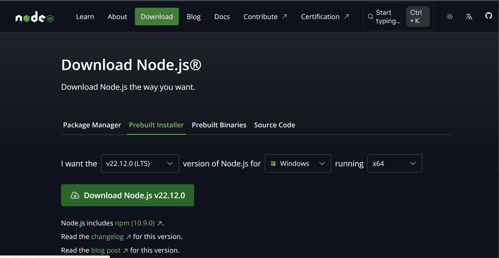
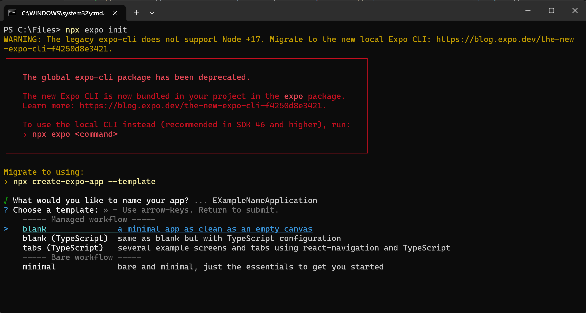
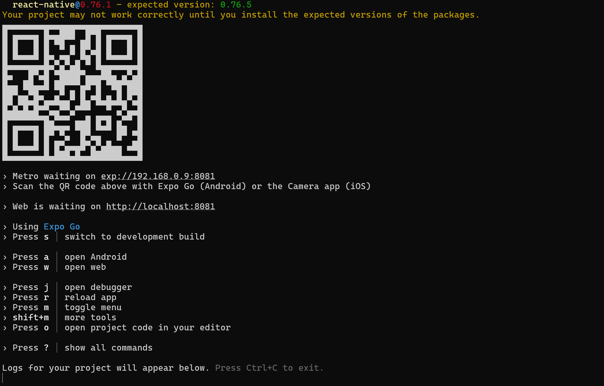
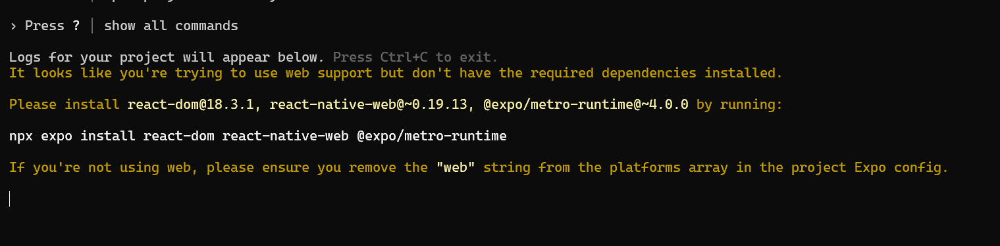
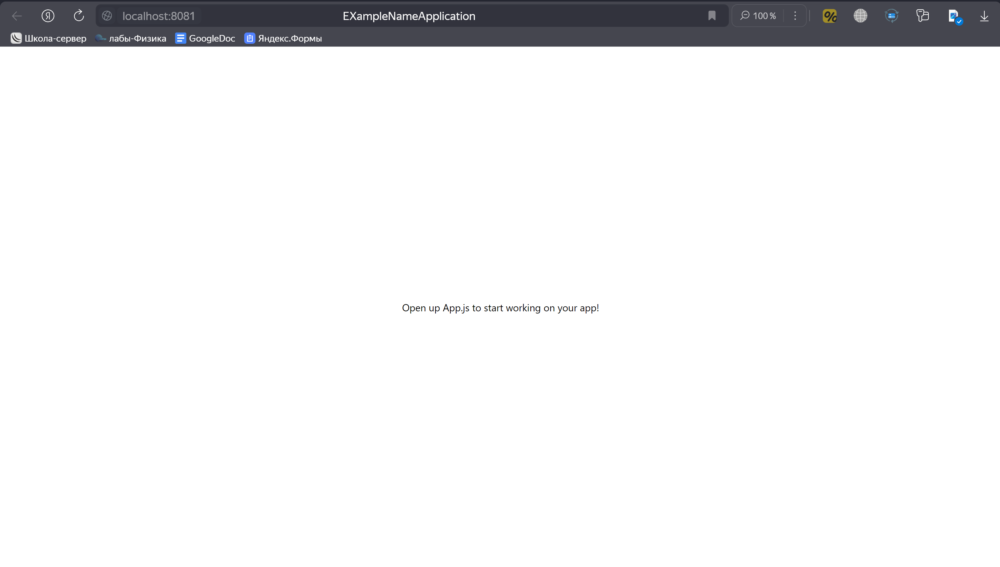

# **React Native**

<br>

## Содержание

1. [Введение](./README.md#введение)
2. [Установка](./README.md#установка)
3. [Готовые программы](./README.md#готовые-программы)
   - [Примеры простых компонентов для приложений](./README.md#примеры-простых-компонентов-для-приложений)
   - [Примеры полноценных монолитных приложений](./README.md#примеры-полноценных-монолитных-приложений)
4. [Полезные ссылки](./README.md#полезные-ссылки)
---

<br>

## Введение

**JavaScript (сокращенно JS)** — это язык программирования, который используется для создания интерактивного и динамического контента на веб-страницах. JavaScript стал одним из ключевых языков веб-разработки, и его основной задачей является взаимодействие с HTML и CSS для создания живых, интерактивных веб-страниц.


**Основные особенности JavaScript**
- Интерактивность: JavaScript позволяет добавлять на страницу такие элементы, как всплывающие окна, анимации, обработка форм и другие интерактивные элементы.
  
- Взаимодействие с DOM: JavaScript может "общаться" с элементами HTML (например, менять текст, добавлять новые элементы, изменять стили) с помощью дерева DOM (Document Object Model).
  
- Асимметричность и работа с сетью: JavaScript поддерживает асинхронные запросы (например, с использованием fetch() или AJAX) для загрузки данных без перезагрузки страницы, что позволяет делать веб-приложения более быстрыми и отзывчивыми.
  
- Кроссплатформенность: JavaScript работает практически везде, где есть веб-браузер, так как поддерживается всеми современными браузерами.
  
- Широкий спектр применения: Хотя изначально JavaScript был языком для веба, теперь его можно использовать и на стороне сервера (например, с помощью Node.js), для создания мобильных приложений и даже для разработки игр.

**React Native** — это фреймворк от Facebook для разработки мобильных приложений на JavaScript с использованием библиотеки React. React Native позволяет создавать мобильные приложения для iOS и Android на одном коде, что значительно упрощает процесс разработки и снижает затраты на создание и поддержку приложений.

**Основные особенности React Native**:

- Кроссплатформенность: React Native позволяет писать один код для iOS и Android, и в большинстве случаев он будет работать одинаково на обеих платформах.

- Использование компонентов React: React Native использует компоненты, аналогичные тем, что используются в веб-версии React. Вы можете создавать интерфейсы, комбинируя компоненты, как конструктор.

- Отображение нативных компонентов: В отличие от веб-приложений, React Native рендерит настоящие нативные компоненты платформы (например, кнопки, текстовые поля), что позволяет получить высокую производительность и "нативное" поведение.

- Горячая перезагрузка (Hot Reload): React Native поддерживает функцию горячей перезагрузки, что позволяет разработчикам сразу видеть изменения в приложении без полной перезагрузки.

- Доступ к нативным API: React Native предоставляет доступ к нативным API (например, камере, геолокации) через JavaScript, а также позволяет легко писать модули на Java/Kotlin для Android и Objective-C/Swift для iOS, если функционала фреймворка недостаточно.

---

<br>

## Установка

Так как React Native использует непосредственно Java Script, то для начала необходимо установить Node.js. Рассмотрим установку для операционной системы Windows:

1. Скачайте последнюю версию Node.js с официального [сайта](https://nodejs.org/en/download/prebuilt-installer)

   Далее необходимо просто запустить файл установки и дождаться окончания процесса. 




**Важно! Чтобы в параметрах установки было выбрано расширение пути Windows (параметр *Add to Path*)**.

2. Установить фреймворк для работы с компонентами. Для этого откроем консоль (*cmd* или *powershell* для Windows) и воспользуемся пакетным менеджером **npm**:

Проверка работоспособности Node.js и npm:

```bash
npm --version
```

Лучшим вариантом фреймворка react native является установка **EXPO**. Для этого воспользуемся командой:

```bash
npm install expo-cli —global
```

Готово! Теперь можно попробовать протестировать и создать первый проект. Для этого можно воспользоваться командой:

```bash
expo init
```

или, если не работает команда выше:

```bash
npx expo init
```



> [!NOTE]
> Для разных языков программирования принято использовать разные приложения, именуемые IDE. Для JavaScript и React Native часто используется **Visual Studio Code**. Для работы с React Native в VS Code можно установить расширение **React Native Tools**, которое подсветит синтаксис и сделает код более читаемым.
>
> Про Visual Studio Code и полезные расширения можно более подробно прочитать [здесь](../General/VSCode.md)

Должна создаться папка с проектом, с помощью команды `cd <Название папки>` переходим в каталог самого проекта, выполняем команду для запуска приложения:

```bash
expo start
```

или, если не работает команда выше:

```bash
npx expo start
```

На выбор нам предложат несколько пунктов, в зависимости от задачи требуется использовать разные дополнительные компоненты. Для запуска WEB -версии приложения достаточно нажать на кнопку *w*.



В процессе может (а скорее всего точно будет) возникнуть ошибка, связанная с отсутствием зависимостей (см. рисунок ниже). Чтобы исправить ее достаточно посмотреть в консоль и скопировать команду, которая все портит:



```bash
npx expo install react-dom react-native-web @expo/metro-runtime
```

После этого снова запустить приложение и проверить WEB интерфейс.

Вот так (примерно), должно выглядеть запущенное приложение на первый момент:



---

<br>

## Готовые программы

### Примеры простых компонентов для приложений

1. [NumPad клавиатура для ввода PIN кода](./keyBoard.md)
2. [Простой компонент для всплывающих уведомлений](./showAlertNotification.md)
3. [Простой пример базы SQLITE базы данных](./simpleDatabase.md)
4. [WEB авторизация с учетом локального хранения cookies](./Auth.md)
5. [Абстракция стандартной навигации](./Navigator.md)
6. [Абстракция навигации через "шторку" (выпадающее меню)](./Curtain.md)

### Примеры полноценных монолитных приложений

1. [ToDo приложение для контроля задач](./ToDoApp.md)

---

<br>

## Полезные ссылки

1. [Официальный сайт React Native](https://reactnative.dev/)
2. [Официальный сайт Expo](https://expo.dev/)
3. [Создание мобильного приложения на React Native](https://habr.com/ru/articles/467609/)

<br><br>
<br><br>

###### 12.01.2025